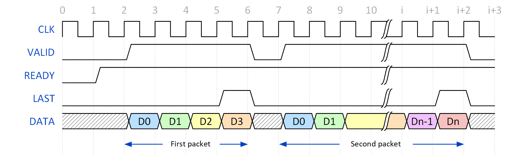
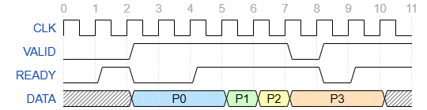
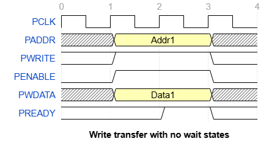
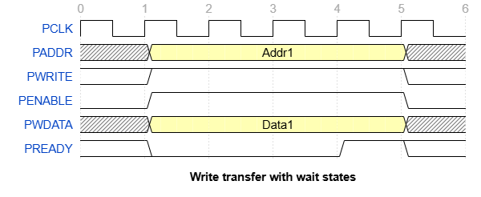
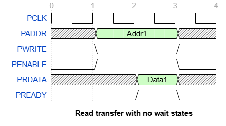
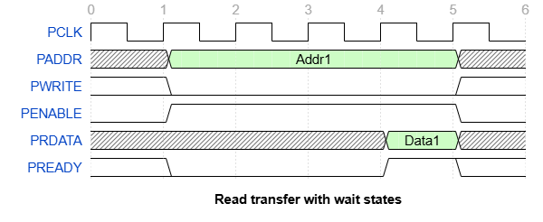

# Описание используемых протоколов

## **AXI-Stream протокол:**

Потоковая передача — это способ передачи данных из одного блока в другой. Идея потоковых устройств заключается в обеспечении постоянного потока высокоскоростных данных, поэтому обычно каждый тактовый импульс передает один новый блок данных. Кроме того, для снижения накладных расходов потоковые шины не имеют адресации. Потоковые соединения являются двухточечными, поэтому адресация не требуется.

Одним из примеров потоковых интерфейсов является интерфейс AXI4-Stream. Он обладает высокой степенью гибкости, имеет некоторые обязательные сигналы и множество дополнительных.

Рассмотрим протокол, его сигналы:

- CLK – тактовый сигнал (потоковая шина AXI синхронна);
- DATA – шина данных;
- READY и VALID – сигналы управления потоком данных;
- LAST - сигнал признак окончания передачи пакета;

Первая транзакция состоит из четырех циклов данных, от D0 до D3. Последний цикл данных отмечается активным стробом сигнала LAST. Обратите внимание, что во время транзакции значения VALID и READY всегда высокие. Вторая транзакция имеет n циклов данных.

VALID и READY используются для управления потоком данных. Если у передатчика больше нет данных для отправки, сигнал VALID становится низким. Аналогичным образом, когда принимающая сторона потока AXI не готова принимать дополнительные данные, она отменяет подтверждение сигнала готовности (READY переходит в 0).

На рисунке ниже показан сценарий, в котором переключаются как READY, так и VALID сигналы. Новые данные могут появиться на шине только в том случае, если VALID и READY были подтверждены на предыдущем такте.

Для данных «P0» VALID и READY подтверждаются вместе только в пятом периоде такта, поэтому в шестом такте могут быть выведены новые данные «P1». Для передачи «P3» также требуется три такта, поскольку в такте 8 подтверждение VALID снимается, а в такте 9 READY снимается. В такт 10 оба утверждаются, поэтому в такт 11 новые данные (не показаны) передаются на шину ведущим устройством.

## **APB протокол:**

Сигнал PSEL, который предназначается для управления адресации трафика между мастером и множеством слейвов, отсутствует. В тестируемом блоке слейв всего один, поэтому данный сигнал решено было не использовать. 

Диаграммы передачи транзакций без использования управляющего сигнала PSEL представлены ниже:

1. Транзакция записи без задержки сигнала готовности слейва PREADY:

   
2. Транзакция записи с задержкой сигнала готовности слейва PREADY:

3. Транзакция чтения без задержки сигнала готовности слейва PREADY:

4. Транзакция чтения с задержкой сигнала готовности слейва PREADY:

