# Инструкция по подключению и использованию вычислительного кластера


## Установка VNC соединения

1. Запустите TigerVNC. Появится окно с вводом IP адреса и порта. Введите адрес, затем введите порт VNC (как правило, 4 цифры)


2. Появится окно с вводом пароля.

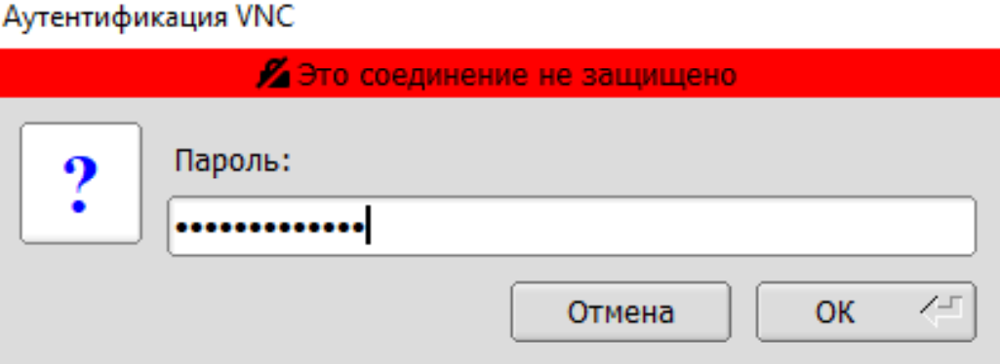

3. При успешном подключении вы увидите рабочий стол удаленного сервера

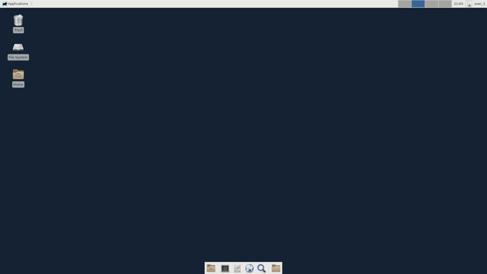

## Скачивание исходного материала

1. Перейдите на [страницу Gitlab](https://gitlab.soc-design-challenge.ru/) Хакатона. Сделать это можно воспользовавшись браузером Firefox на удаленном сервере (открыть его можно кликнув на иконку земного шара с курсором снизу экрана) или любым другим браузером на компьютере. Введите логин и пароль

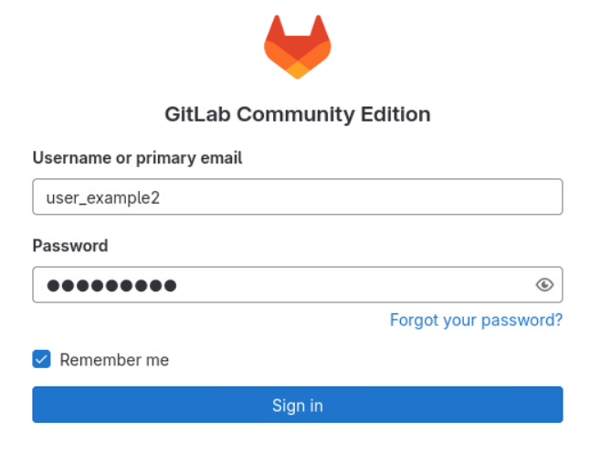

2. При успешном входе необходимо перейти во вкладку **Groups**. Там вы увидите список доступных вам репозиториев:
   - `cicd` - репозиторий с конфигурацией CI, который проводит автоматическое тестирование **(взаимодействие с ним не предусмотрено)**
   - `uvm2026` - рабочий репозиторий вашей команды
3. Для работы вам необходимо склонировать ваш рабочий репизиторий `uvm2026` в любое доступное место на удаленном сервере

Для этого скопируйте ssh ссылку на клонирование репозитория:

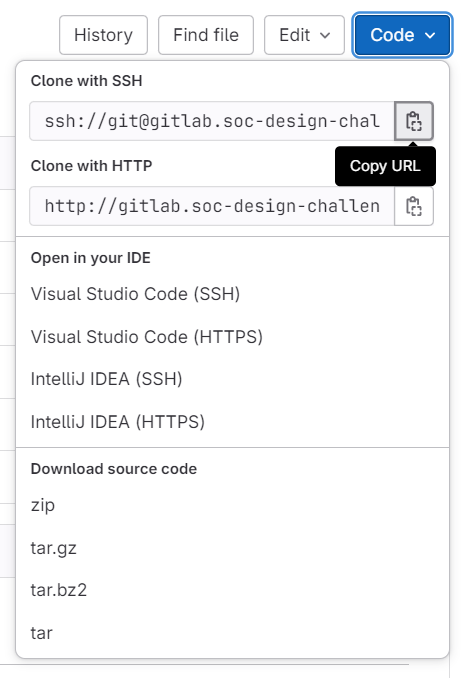

Затем откройте терминал в папке, куда хотите склонировать репозиторий:

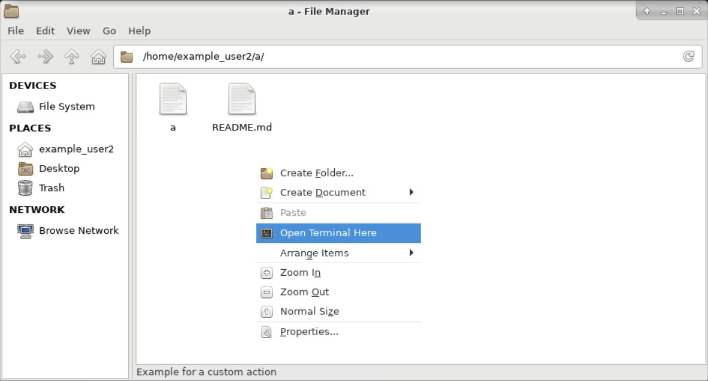

Введите команду `git clone *copied_ssh_link*`:

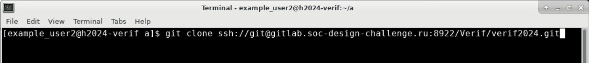

При возникновении в терминале необходимости подтверждения введите `yes`.

4. Во избежание дальнейших проблем при работе с git задайте значения для email и name с помощью команд:
```
git config --global user.email "you@example.com"
git config --global user.name "Your Name"
```
Двойные кавычки обязательны для обрамления ваших значений.

Введенные значения ни на что не повлияют, но будет удобнее, если вы введете валидные значения одного из членов команды.


## Подготовка файлов к работе

1. Перейдите в терминале в папку репозитория uvm2026 (команда [cd](https://losst.pro/komanda-cd-linux)). Создайте там ветку командой `git checkout -b *your_branch_name*` (в самой команде звездочками обрамлять название ветки не нужно)
3. В папке `dut_protected` есть 28 номерных директорий. В них содержатся зашифрованные RTL дизайны **с различными ошибками**. Используя их, вы можете локально отлаживать разработанные вами scoreboard. Чтобы компилировать определённый номер зашифрованного сломанного RTL дизайна, укажите номер в иерархическом пути файла  `tb_files.lst`

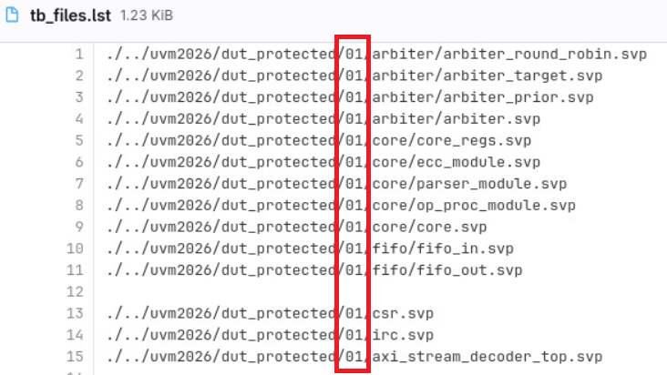

## Запуск симуляции

1. Создайте папку **на одном уровне с выкаченным репозиторием uvm2026**, в которой будут храниться результаты локальных запусков симуляции, и перейдите в нее в терминале
1. Выполните в терминале команду module load AGE
1. Выполните в терминале команду qrsh
1. После qrsh вы зайдёте на node, но вас откинет по директории обратно в /home/, нужно будет вернуться в рабочую папку, созданную в п.1 (командой cd)

5. Загрузите программный модуль Xcelium командой `module load cadence/XCELIUMMAIN/22.03`

6. Запустите локальную симуляцию, вызвав работу скрипта `run.sh` из рабочей папки. Не забудьте предварительно задать нужный параметр `testname` в скрипте

Команда для запуска скрипта `run.sh`:
```
bash ./../uvm2026/run.sh
```

1. Откроется графический интерфейс Simvision (Design Browser и Console). Инструкцию по работе с ним можно найти [здесь](./methodics_and_guides.md#отладка-gui).

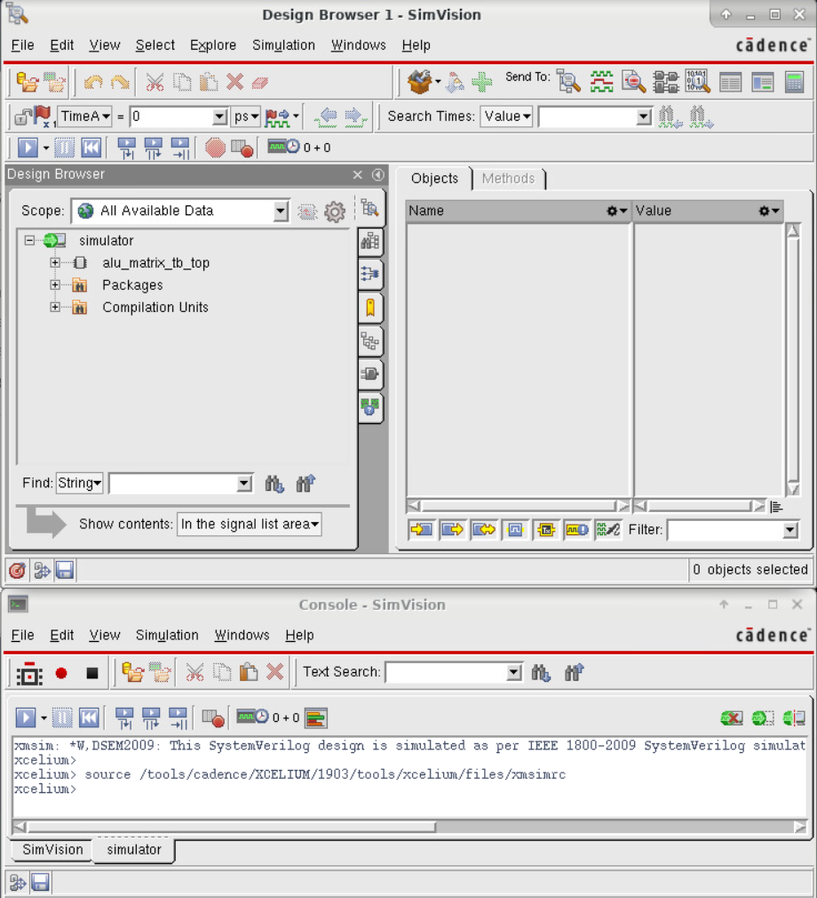

## Тестирование разработанного функционала на кластере

1. После локальной отладки разработанного функционала scoreboard и тестов необходимо сделать коммит изменений

Используйте команду `git add -A` для добавления всех новых/измененных файлов проекта в список к следующему коммиту.

Затем используйте команду `git commit -m "Your comment to commit"` для выполнения коммита. В кавычках измените текст на собственный комментарий к коммиту.

2. Загрузите выполненный коммит на сервер, используя команду `git push origin *your_branch_name*`. Используйте название своей ветки вместо \*your_branch_name\* (в самой команде звездочками обрамлять название ветки не нужно).

После выгрузки на сервер ветки с коммитом вы увидите ее в списке веток репозитория на Gitlab:

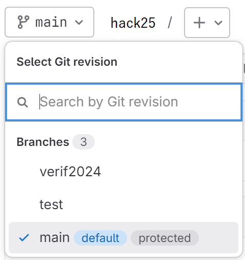

Перейдите на загруженную только что ветку.

1. В верхней части страницы находится небольшая информационная иконка о состоянии прохождения симуляции на наборе дизайнов. Нажмите на эту иконку

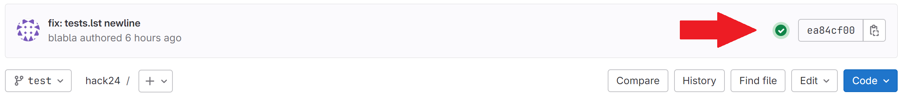

4. Запустите проверку, нажав на треугольник значок

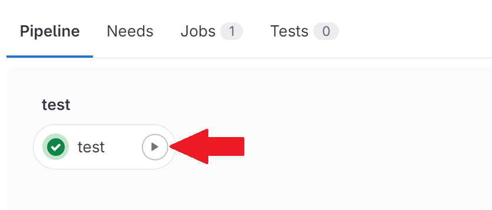

5. Откройте запустившуюся проверку, кликнув на нее.

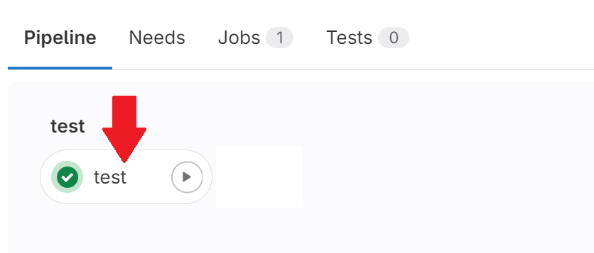

6. Здесь находится журнал работы скрипта CI. Дождитесь завершения работы CI и внимательно ознакомьтесь с журналом, там будут выводиться обнаруженные вашим тестбенчом ошибки в проверяемых дизайнах. **Важно:** даже если сборка или тест **не проходят**, вы всё равно будете видеть зелёный кружок у "test". Изучать логи нужно после каждого запуска **всегда**.

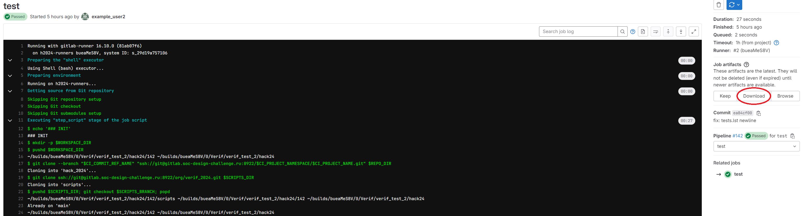

7. Чтобы посмотреть полученные в ходе тестирования временные диаграммы, откройте журнал **в браузере Firefox на удаленном сервере** и нажмите кнопку `Download` справа (выделена на рисунке сверху красным)

8. В директорию `Загрузки` скачается архив, который лучше перенести в другое место, путь до которого не содержит русских символов. Далее перейдите в терминале в папку, где лежит архив, и введите команду `unzip *archive_name*` для разархивации

9. Откройте Simvision, используя команду `simvision`

Дальнейшие шаги повторяют материал из [гайда](./methodics_and_guides.md#отладка-gui)

10. Нажмите File, а затем Open Database (или сочетание клавиш Ctrl + O)

11. Зайдите в папку, полученную из архива. Затем в папку `results` и в номерную папку `dut`. Выберите файл формата `.shm`, нажмите Open. Закройте окно `Open Database`

12. В Design Browser (слева) раскройте выпадающий список до env_if включительно. Выберите все интерфейсы и кликните `Send to Waveform Window`. Таким образом вы можете смотреть временные диаграммы

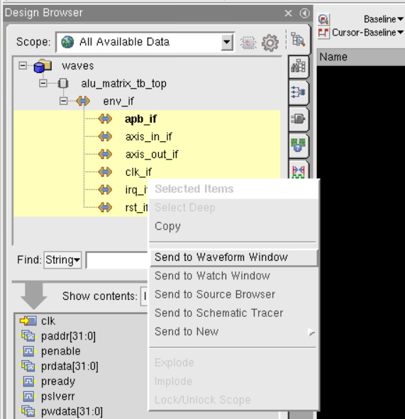
