# AXI-Stream Decoder Architecture Specification (AS)

## Оглавление

  - [Введение](#введение)
  - [Информация об используемых протоколах](#информация-об-используемых-протоколах)
  - [Параметры AXI Stream Decoder](#параметры-axi-stream-decoder)
  - [Назначение](#назначение)
  - [Функциональное описание](#функциональное-описание)
    - [Структурная схема](#структурная-схема)
    - [Описание входных и выходных сигналов дизайна](#описание-входных-и-выходных-сигналов-дизайна)
    - [Функциональная схема](#функциональная-схема)
    - [Алгоритм работы модуля](#алгоритм-работы-модуля)
      - [Исправление ошибок в инструкции](#исправление-ошибок-в-инструкции)
      - [Расшифровка инструкции](#расшифровка-инструкции)
      - [Предварительная обработка данных](#предварительная-обработка-данных)
      - [Построение команды единого формата](#построение-команды-единого-формата)
      - [Выбор выходной очереди](#выбор-выходной-очереди)
    - [Описание стандартного режима работы](#описание-стандартного-режима-работы)
    - [Структура пакета AXI Stream](#структура-пакета-axi-stream)
      - [Входные пакеты](#входные-пакеты)
      - [Выходные пакеты](#выходные-пакеты)
    - [Описание процесса декодирования](#описание-процесса-декодирования)
    - [Описание процесса предварительной обработки данных](#описание-процесса-предварительной-обработки-данных)
      - [Пример обработки инструкции](#пример-обработки-инструкции)
    - [Описание процесса выбора выходной очереди для команды](#описание-процесса-выбора-выходной-очереди-для-команды)
    - [Примечания по работе арбитра](#примечания-по-работе-арбитра)
    - [Буферизация данных](#буферизация-данных)
    - [Описание работы контроллера прерываний](#описание-работы-контроллера-прерываний)
      - [Типы прерываний от CORE](#типы-прерываний-от-core)
      - [Типы прерываний от Arbiter](#типы-прерываний-от-arbiter)
      - [Типы прерываний от FIFO](#типы-прерываний-от-fifo)
      - [Расположение полей типов прерываний в регистрах контроллера прерываний](#расположение-полей-типов-прерываний-в-регистрах-контроллера-прерываний)
  - [Операционные регистры](#операционные-регистры)
    - [Таблица адресных пространств подмодулей](#таблица-адресных-пространств-подмодулей)
    - [CORE](#core)
    - [DATA registers](#data-registers)
    - [Arbiter](#arbiter)
    - [FIFO](#fifo)
    - [Interrupt controller](#interrupt-controller)
  - [Программирование блока](#программирование-блока)
    - [Действия для сброса или настройки блока](#действия-для-сброса-или-настройки-блока)
    - [Особенности программирования регистров](#особенности-программирования-регистров)
      - [CORE](#core-1)
      - [FIFO](#fifo-1)
      - [Arbiter](#arbiter-1)
      - [Interrupt Controller](#interrupt-controller-1)
    - [Обработка прерываний](#обработка-прерываний)

---


## Введение

AXI Stream Decoder (далее - Decoder) включает в себя 1 входной и 3 выходных порта AXI Stream, по которым проходят транзакции в соответствии с описанным протоколом.


## Информация об используемых протоколах

1. **AXI-Stream протокол** (далее - AMBA AXI4-Stream)
2. **APB подобный протокол** (далее - AMBA APB3)


## Параметры AXI Stream Decoder

| Название            | Значение | Описание                                               |
|---------------------|----------|--------------------------------------------------------|
| AXI_TDATA_WIDTH_IN  | 32       | Ширина входной шины TDATA интерфейса AMBA AXI4-Stream  |
| AXI_TDATA_WIDTH_OUT | 24       | Ширина выходной шины TDATA интерфейса AMBA AXI4-Stream |
| APB_PADDR_WIDTH     | 8        | Ширина шины PADDR интерфейса AMBA APB3                 |
| APB_PDATA_WIDTH     | 8        | Ширина шин PRDATA и PWDATA интерфейса AMBA APB3        |


## Назначение

Типичным случаем использования Decoder является система, предназначенная для выполнения потока инструкций. Схематическое изображение системы приведено ниже, под схемой приведено описание системы.

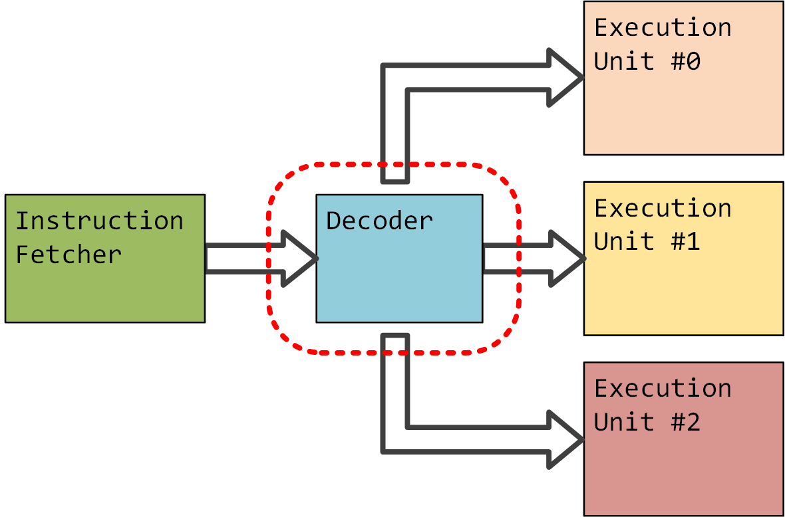

Модуль Instruction Fetcher создает и отправляет зашифрованные пакеты данных, называемые в Decoder инструкциями. Непосредственно в Decoder происходит расшифровка и распределение инструкций на разные очереди исполнения. Из выходных очередей команды переходят в Execution Units (далее - исполнительные блоки), где происходит их выполнение. 


## Функциональное описание

За передачу данных в контроллер и из него отвечают 1 входной и 3 выходных порта соответственно, работающие по протоколу AMBA AXI4-Stream. Доступ к управляющим регистрам дизайна осуществляется через выделенный порт, функционирующий по протоколу AMBA APB3.


### Структурная схема

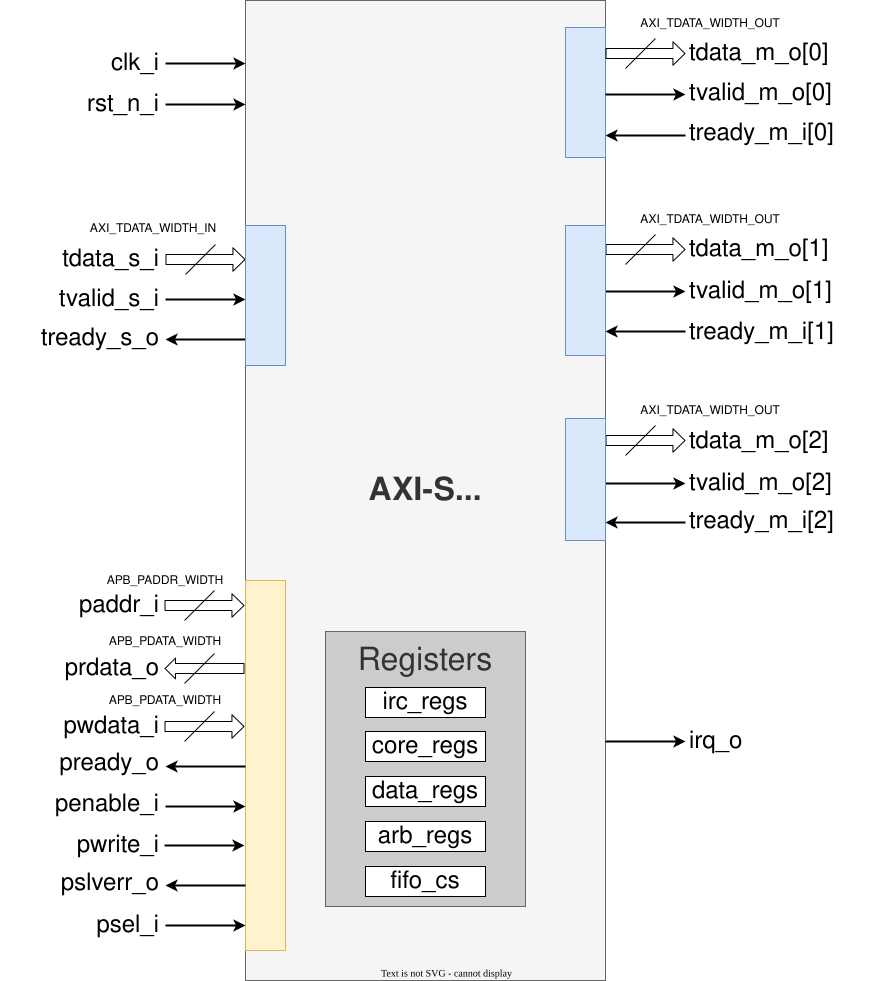

### Описание входных и выходных сигналов дизайна

| Название                | Направление     | Разрядность         | Описание                                                              |
|-------------------------|-----------------|---------------------|-----------------------------------------------------------------------|
| `clk_i`                 | Input           | 1                   | Тактовый сигнал.<br>Весь блок работает в одном тактовом домене        |
| `rst_n_i`               | Input           | 1                   | Синхронный сигнал сброса.<br>Активный уровень – низкий                |
| `irq_o`                 | Output          | 1                   | Сигнал прерывания. Активный уровень – высокий                         |
| *AXI Stream IN*<br>*Входной интерфейс AXI Stream*                                                                                       |
| `tdata_s_i`             | Input           | AXI_TDATA_WIDTH_IN  | Шина передачи данных                                                  |
| `tvalid_s_i`            | Input           | 1                   | Сигнал валидности данных tdata_s_i на шине                            |
| `tready_s_o`            | Output          | 1                   | Сигнал готовности slave к приёму данных tdata_s_i по шине             |
| *AXI Stream OUT*<br>*Выходные интерфейсы AXI Stream*                                                                                    |
| `tdata_m_o[n]`          | Output          | AXI_TDATA_WIDTH_OUT | Шина передачи данных                                                  |
| `tvalid_m_o[n]`         | Output          | 1                   | Сигнал валидности данных tdata_m_o[n] на шине                         |
| `tready_m_i[n]`         | Input           | 1                   | Сигнал готовности slave к приёму данных tdata_m_o[n] по шине          |
| *APB*<br>*Интерфейс для доступа к регистрам устройства*                                                                                 |
| `paddr_i`               | Input           | APB_PADDR_WIDTH     | Шина адреса                                                           |
| `pwdata_i`              | Input           | APB_PADDR_WIDTH     | Шина данных от master к slave                                         |
| `prdata_o`              | Output          | APB_PADDR_WIDTH     | Шина данных от slave к master                                         |
| `psel_i`                | Input           | 1                   | Сигнал, маркирующий выбор slave устройства                            |
| `penable_i`             | Input           | 1                   | Сигнал, маркирующий наличие активного запроса от master к slave       |
| `pready_o`              | Output          | 1                   | Сигнал, маркирующий предоставление ответа на запрос от slave к master |
| `pwrite_i`              | Input           | 1                   | Сигнал, маркирующий тип запроса от master к slave (запись/чтение)<br>1 - запись<br>0 - чтение |
| `pslverr_o`             | Output          | 1                   | Сигнал, маркирующий статус выполнения запроса<br>0 – выполнено успешно<br>1 – произошла ошибка (подробнее обо всех случаях в пункте [Особенности программирования регистров](#особенности-программирования-регистров)) |


### Функциональная схема

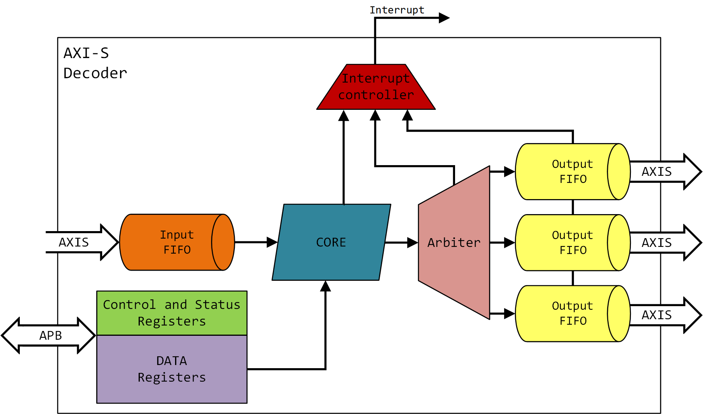

В состав модуля Decoder входят:

- **CORE** - блок отвечающий за расшифровку и обработку инструкций;
- **Arbiter** - блок распределения результатов преобразования;
- **Interrupt controller** - программируемый контроллер прерываний, который собирает критические сигналы из всех блоков и сигнализирующий о наиболее приоритетном из них;
- набор **FIFO** (1 на входе и 3 на выходе);
- программируемые по **APB**-интерфейсу регистры - для управления всеми структурными блоками (**Control and Status Registers**), а также регистры данных (**DATA Registers**), используемые в **CORE**.


### Алгоритм работы модуля

Модуль Decoder обрабатывает входные инструкции по следующему алгоритму:

1. Проверка целостности данных по коду коррекции ошибок. Исправление данных, если возможно;
2. Выделение полезных данных из инструкции;
3. Предварительная обработка операндов;
4. Построение команды единого формата;
5. Выбор выходной очереди.

#### Исправление ошибок в инструкции

Чтобы обеспечить высокую надёжность и отказоустойчивость системы, в инструкции внедрена избыточность и встроены данные для восстановления изначальной информации при её искажении. Сделано это путём добавления к данным кода коррекции ошибок (Error Correction Code), являющегося расширенным кодом Хэмминга, что позволяет исправить единичный ошибочный бит, а если было испорчено два бита данных - сигнализировать об ошибке. 
```diff
! Максимальное количество ошибок в инструкции !

Считается, что больше двух ошибок произойти не может.
```


#### Расшифровка инструкции

Decoder производит дешифровку инструкции: выделяет из зашифрованных пакетов различных форматов полезные данные. Состав инструкции подробно описан в разделе [Входные пакеты](#входные-пакеты).

#### Предварительная обработка данных

Для оптимизации критических путей и из-за особенностей схемотехники исполнительных блоков в блоке Decoder производится предварительная обработка данных. Возможные варианты обработки данных приведены в разделе [Описание процесса предварительной обработки данных](#описание-процесса-предварительной-обработки-данных).

#### Построение команды единого формата

Из полученных в результате расшифровки и предварительной обработки данных составляется команда единого формата, приведённого в разделе [Выходные пакеты](#выходные-пакеты).

#### Выбор выходной очереди

На последнем этапе сформированная команда направляется в одну из выходных очередей в соответствии с определёнными правилами, подробно описанными в разделе [Описание процесса выбора выходной очереди для команды](#описание-процесса-выбора-выходной-очереди-для-команды).


### Описание стандартного режима работы


```diff
! Понятийная заметка !

По строгим трактовкам в протоколе AMBA AXI4-Stream границы пакетов всегда обозначаются сигналом tlast, который отмечает последнее слово (beat) в пакете. Если сигнал tlast отсутствует, то это одиночная транзакция (single transfer).

В данном AS, несмотря на отсутствие tlast, отсюда и ниже по документу предлагаем считать передаваемую "одиночную транзакцию" за "пакет".
```

Входная транзакция блока имеет вид - "1 пакет - 1 инструкция" с возможностью потоковой передачи данных (Ins1, Ins2, Ins3... - отдельные инструкции).

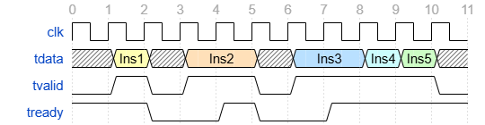

При наличии активного сигнала готовности данных (**tvalid**) и активного сигнала готовности принять данные (**tready**) 32-битные пакеты данных (с шины **tdata**) принимаются синхронным **FIFO** на входе модуля.

Аналогичным образом в части протокола обмена данными работают выходные интерфейсы Decoder.

```diff
! Время прохождения инструкций !

Время обработки одной входной инструкции от handshake на входном AXI-Stream интерфейсе до появления команды на входе одного из выходных FIFO составляет 3 такта.  
Обработка инструкций представлена конвейерным типом, следовательно поток входных инструкций может быть непрерывным.
```

### Структура пакета AXI Stream

Входные пакеты данных, приходящие по AXI-Stream интерфейсу, называются инструкциями, а выходные - командами.  
Входные инструкции имеют три различных формата, выходные команды соответствуют единому формату.

#### Входные пакеты

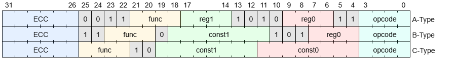

Все инструкции состоят из набора полей:

1. Код операции (**opcode**) - 4 бита - поле, определяющее тип инструкции, т.е. то, как следует её расшифровать;
2. Операнды - два поля по 4(**reg**)/8(**const**) бит - данные для исполнительного блока. Могут быть подвергнуты обработке подробнее в разделе [Описание процесса предварительной обработки данных](#описание-процесса-предварительной-обработки-данных);
3. Функция (**func**) - 4 бита - поле, определяющее процесс предварительной обработки операндов в Decoder и действие исполнительного блока над данными;
4. Код коррекции ошибок (**ECC**) - 5+1 бит - код коррекции ошибок. 5 бит для проверки частных чётностей (31-27 биты инструкции), один общий бит чётности (26 бит инструкции);
5. Зарезервированные биты, значения которых фиксированы для соответствующих типов инструкций (биты закрашенные серым).

Инструкции разделяются на три основных типа: **A-type**, **B-type**, **C-type**. Типы инструкций отличаются типами операндов и расположению полезной информации в инструкции.

| Тип инструкции | Значение поля opcode | Типы операндов                                                                    |
|----------------|----------------------|-----------------------------------------------------------------------------------|
| A              | 4'b0101              | два операнда типа "адрес" (**reg0**, **reg1**)                                    |
| B              | 4'b1001              | один операнд типа "адрес" (**reg0**) и один операнд типа "константа" (**const1**) |
| C              | 4'b1010              | два операнда типа "константа" (**const0**, **const1**)                            |

```
Отличие типов операндов входной инструкции

Отличие операнда типа "константа" от оператора типа "адрес" заключается в том, что значение константы берётся напрямую из инструкции, а значение для операнда типа "адрес" берется из регистра данных Decoder по адресу DATA_BA + reg0/1.
```

#### Выходные пакеты

Выходные пакеты данных, называемые командами, имеют единый формат и состоят из двух 8-битных полей данных (**data0** и **data1**) и 4-битного поля функции (**func**). Старшие 4 бита являются зарезервированным полем, имеющим фиксированное значение 4'b0101.  

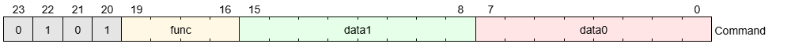


### Описание процесса декодирования

Процесс декодирования заключается в выделении полезных данных из инструкции (функции и двух операндов) для формирования единого пакета.

Поле **func**, выделенное при декодировании, без изменений записывается в поле **func** выходной команды. 

Соответствие данных выходной команды и входных операндов приведено в таблице:

| Тип инструкции | Данные для data0             | Данные для data1             |
|:--------------:|------------------------------|------------------------------|
| A              | Данные из **reg0** регистра  | Данные из **reg1** регистра  |
| B              | Данные из **reg0** регистра  | Данные инструкции **const1** |
| C              | Данные инструкции **const0** | Данные инструкции **const1** |


### Описание процесса предварительной обработки данных

В зависимости от функции инструкции (**func**) к операндам применяются различные типы предобработки.

Есть 3 типа предобработки, применяемых к одному операнду, и один тип, применяемый сразу к обоим операндам.

Типы предобработки, применяемые к одному операнду, представлены в таблице ниже: 

| Тип предобработки | Описание               | Примеры   | для разных | начальных данных |
|-------------------|------------------------|-----------|------------|------------------|
|                   |                        | 1001_1010 | 0010_1101  | 0000_0111        |
| **neg**           | Поразрядное отрицание  | 0110_0101 | 1101_0010  | 1111_1000        |
| **shift**         | Логический сдвиг влево | 0011_0100 | 0101_1010  | 0000_1110        |
| **mirror**        | Зеркальное отражение   | 0101_1001 | 1011_0100  | 1110_0000        |

В качестве типа предобработки для обоих операндов используется перестановка операндов (**op_swap**) - на место data0 выставляется операнд с первой позиции (**reg1**/**const1**), на место data1 - c нулевой (**reg0**/**const0**).

Тип **mirror** применяется только к нулевому операнду (**data0**), типы **neg** и **shift** применяются к нулевому (**data0**) или первому операнду (**data1**) в зависимости от функции.

Карта соответствия типов предобработки и функций (**func**) приведена в таблице (**no** - предобработка не применяется; числа **0** и **1**, стоящие после **neg** и **shift**, означают номер операнда, над которым производится предобработка: **0 - data0, 1 - data1**).

|                   |    | Младшие     | биты        | функции     | (func)     |
|-------------------|----|-------------|-------------|-------------|------------|
|                   |    | 00          | 01          | 10          | 11         |
| **Старшие**       | 00 | **no**      | **no**      | **neg0**    | **neg0**   |
| **биты**          | 01 | **no**      | **op_swap** | **neg1**    | **neg1**   |
| **функции**       | 10 | **shift0**  | **shift0**  | **mirror**  | **mirror** |
| **(func)**        | 11 | **shift1**  | **shift1**  | **mirror**  | **mirror** |

#### Пример обработки инструкции

Пусть на вход Decoder поступает инструкция **'h3363BD59**, что соответствует **32'b0011_0011_0110_0011_1011_1101_0101_1001**.

Старшие 6 бит соответствуют коду Хэмминга (**ECC**): 5 бит частичных битов чётности **5'b00110** и 1 бит общей чётности - **1'b0**.

По результатам проверки делаем вывод, что ошибок в принятых данных не наблюдается.

Младшие 4 бита **4'b1001** относятся к полю **opcode** и соответствуют значению инструкции типа B. Сопоставим шаблон инструкции с полученной инструкцией и выделим из неё данные.

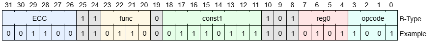

Операнд **reg0** входной инструкции имеет тип "адрес" и значение **4'b0101 = 'd5**. Значит значение операнда **data0** выходной команды соответствует значению в регистре **DATA_REGS\[5]** (по адресу 0xD5 в карте регистров). Пусть в данном регистре находится значение **8'b11110011.**

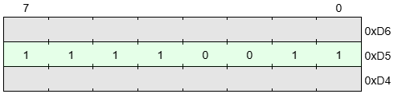

Операнд **const1** входной инструкции - константа **8'b01110111**.

Значение функции - **4'b0110**, что соответствует типу предобработки **neg1**. Значит требуется выполнить побитовое отрицание операнда **const1**. В данном случае получим **8'b10001000**, что является значением операнда **data1** выходной команды.

В результате получается следующая команда:

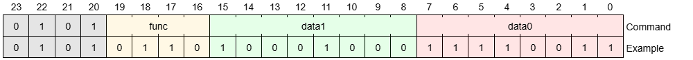

(Значение команды в шестнадцатеричной системе = **'h5688F3**)


### Описание процесса выбора выходной очереди для команды

Подмодуль Arbiter (далее - Арбитр) принимает обработанные команды от CORE и в зависимости от настроек отправляет данные на выходные буферы.

Арбитр имеет 3 режима работы:

- Последовательный
- Таргетированный
- Приоритетный

Режим работы арбитра определяется значением в регистре **CONTROL**.

Для каждого режима работы арбитра задаются правила, согласно которым команда будет направляться на тот или иной выход.

1. Последовательный (Round-robin) арбитраж.
   
   Арбитр последовательно в соответствии с заданным правилом round_rule (см. рег. **ROUND_RULE_SET**) отправляет команды на выходные очереди.  
   Настройка **cm_per_out** позволяет задать количество команд, которое будет отправляться на выход за одно переключение направления. Указатель активного выхода переключается на 0-й после перезаписи значения регистра **cm_per_out** или при активном сигнале сброса (подробнее см. [раздел "Особенности программирования регистров", подраздел "Arbiter"](#arbiter-1)).  
   На рисунке ниже представлен пример штатной работы последовательного режима арбитра (с изменением значения **cm_per_out** в процессе работы):

   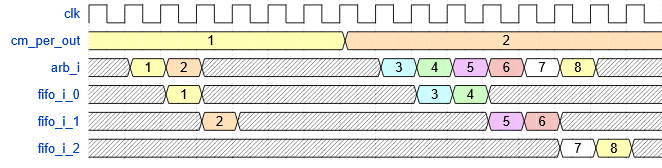
2. Таргетированный (Target) арбитраж  
   Арбитру задаются правила target_rule_0 (см. рег. **TARGET_RULE_0_SET**), target_rule_1 (см. рег. **TARGET_RULE_1_SET**) и target_rule_2 (см. рег. **TARGET_RULE_2_SET**).  
   target_rule_0 действует исключительно на инструкции типа A, target_rule_1 - на инструкции типа B, target_rule_2 - на инструкции типа C.  
   В соответствии с заданными правилами команды будут выходить только по указанным выходам (**target_out**). Если какое-то правило выключено, то команды, образованные из инструкций с соответствующим **opcode**, будут отброшены.  
   Также можно указать номер выхода, с которого будет выходить копия команды (**fork_out**).  
   На рисунке ниже представлен пример штатной работы таргетированного режима арбитра с настройкой одного из правил:

   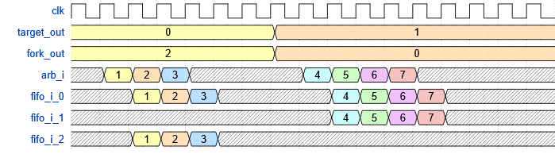
3. Приоритетный арбитраж  
   Арбитру задаётся правило prior_rule (см. рег. **PRIOR_RULE_SET**), в соответствии с которым команды будут выходить по указанному основному выходу (**prior_out**).  
   Если выходной буфер основного выхода не может принять новую команду (например, выходной FIFO заполнен), то команда будет послана на запасной выход (**reserved_out**), если он не заполнен.  
   На рисунке ниже представлен пример штатной работы приоритетного режима арбитра (с изменением значений **prior_out** и **reserved_out** в процессе работы):
   
   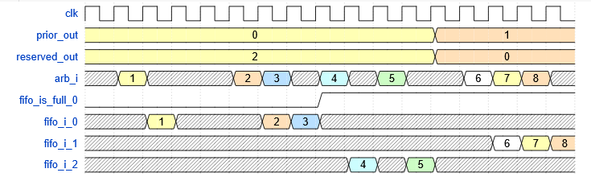


### Примечания по работе арбитра

```diff
! Выбор заполненной очереди !

Если арбитр выбрал в качестве выходной очереди заполненную FIFO, то эта команда будет отброшена.  
В приоритетном режиме данное правило применяется только к запасному выходу (**reserved_out**).
```

Если выбран последовательный (Round-robin) режим работы арбитра, и выходное FIFO, на которое указывает внутренний указатель, заполнено, то команда будет отброшена с записью инкрементированного значения в статистику (см. рег. **ROUND_RULE_STAT**), а внутренний указатель номера выхода продолжит работу в соответствии с настройками (т.е., например, при cm_per_out = 1 номер выхода переключится на следующий).

Если выбран таргетированный (Target) режим работы арбитра, и выходное FIFO, указанное в поле **target_out** регистра правила target_rule_\*, заполнено, то копия команды на выход с индексом значения поля **fork_out** подаваться не будет.

**Причины прерываний в Арбитре:**

1. Если задано значение поля **stat_irq** соответствующего регистра правила (см. Операционные регистры), и поле **stat** соответствующего регистра правила в любом активном режиме работы арбитра достиг такого значения, что stat &gt;= stat_irq, то будет выставлено прерывание **ARB_INTR_THRS**;
2. Если FIFO выходной очереди заполнено, а Арбитр пытается записать туда еще одну команду, то команда будет отброшена, и будет выставлено прерывание **ARB_INTR_NO_OUT**.  
Однако, существуют тонкости работы данного прерывания для каждого режима работы:

   - Для **Последовательного** режима работы Арбитра правило из п. 2 работает без изменений;
   - Для **Таргетированного** режима работы Арбитра правило из п. 2 работает **ТОЛЬКО** для выхода **target_out.** В случае переполнения FIFO только выхода **fork_out** прерывание **ARB_INTR_NO_OUT** выставлено не будет;
   - Для **Приоритетного** режима работы Арбитра при **prior_out** != **reserved_out**, **prior_out** != 3 и **reserved_out** != 3 прерывание будет выставлено **ТОЛЬКО** при переполнении FIFO выходной очереди **reserved_out**.


### Буферизация данных

На входном и выходных интерфейсах установлены FIFO буферы (см. раздел [Функциональная схема](#функциональная-схема)), управление которыми осуществляется по APB-шине.

В выходных FIFO можно управлять максимальной глубиной (рег. **FIFO_DEPTH**) и пороговым значением заполненности буфера (рег. **FIFO_THRS**), при достижении/превышении которого сработает прерывание.  
Настройка максимальной глубины и порогового значения для прерывания производится сразу для всех выходных FIFO, т.е. значения регистра **FIFO_DEPTH** и регистра **FIFO_THRS** влияют на все выходные FIFO.

Для входного и выходных FIFO также реализована возможность полной очистки через запись в регистр **FIFO_CLR**. Очистка производится одновременно для всех FIFO. Очистка производится спустя два восходящих фронта тактового сигнала после write handshake на APB шине.

Входной буфер имеет выходной сигнал, который передается напрямую во внешний сигнал дизайна tready_s_o. Чтобы буфер выставил этот сигнал в **1**, необходимо записать **1** в регистр **FIFO_IN_EN**. Запись **0** выставит на tready_s_o низкий уровень сигнала, а следовательно Decoder не сможет принимать данные.  
Однако данные, которые хранились внутри FIFO до получения в регистре **FIFO_IN_EN** значения **0**, будут обработаны и отправлены на выходные FIFO, если не будут отброшены по той или иной причине, описанной в рамках спецификации.

```diff
! Входная FIFO не может быть переполнена !

Входная FIFO очередь обладает достаточной глубиной, чтобы не иметь возможности переполниться, поэтому не стоит уделять время проверке входного FIFO на Хакатоне.
```


### Описание работы контроллера прерываний

Контроллер прерываний является блоком-агрегатором сигналов ошибок и предупреждений из всех подмодулей Decoder.

При получении сигнала ошибки из любого подмодуля, если для данного сигнала в регистре активации прерываний **INTR_EN** установлена **1**, контроллер выставляет сигнал прерывания в **1** и записывает в соответствующее поле регистра статуса прерываний **INTR_STAT** **единицу**.  
Сигнал прерывания остаётся в высоком состоянии до программного сброса по **APB**-интерфейсу через запись в регистр **INTR_CLR**.

Если происходит одновременное срабатывание нескольких сигналов ошибок, в регистр **INTR_STAT** записываются **единицы** в поля соответствующие полученным ошибкам.  
Если после срабатывания одного прерывания и до его сброса пришел другой сигнал ошибки, регистр статуса дополняется, а сигнал прерывания не сбрасывается.

Для сброса прерывания требуется записать в регистр **INTR_CLR** пакет данных, в котором на позициях очищаемых прерываний стоят **единицы**. Попытка очистки неактивного прерывания не вызовет никаких изменений.

Контроллер прерываний обладает возможностью отключения отдельных прерываний, для чего требуется записать в регистр **INTR_EN** пакет данных аналогичный данным при сбросе (запись **единицы** в определённое поле **INTR_EN** включает данное прерывание).

#### Типы прерываний от CORE

**CORE_INTR_ECC_2** (double ECC error) - в полученной инструкции зафиксирована двойная ошибка данных. Восстановить данные невозможно (вызвавшая данное прерывание команда будет выброшена из потока).

**CORE_INTR_INV_OP** (invalid opcode) - получена инструкция с неизвестным значением поля **opcode** (вызвавшая данное прерывание команда будет выброшена из потока).

**CORE_INTR_RES_ER** (reserved bits error) - в полученной инструкции зарезервированные биты отличаются от стандартных. 

```diff
! Приоритет прерываний от CORE !

Инструкция может вызвать не более **одного** прерывания от CORE.  
Значение поля **opcode** проверяется только у валидной инструкции, т.е. у которой нет ошибок ECC, либо она одна, и была исправлена. Поэтому не может быть одновременно прерывания **CORE_INTR_ECC_2** и **CORE_INTR_INV_OP**.  
Аналогично маска зарезервированных битов проверяется только у инструкций, у которых валидное значение **opcode**. Т.е. не может быть одновременно **CORE_INTR_INV_OP** и **CORE_INTR_RES_ER**.
```

#### Типы прерываний от Arbiter

**ARB_INTR_NO_OUT** (no ready output) - попытка записи данных арбитром в выходную очередь (FIFO), которая является заполненной (вызвавшая данное прерывание команда будет выброшена из потока). 

**ARB_INTR_CM_THRS** (command threshold) - значение поля **stat** соответствующего регистра правила арбитра достигло значения **stat_irq** соответствующего регистра правила.  

#### Типы прерываний от FIFO

**FIFO_INTR_SAT** (FIFO saturation) - количество элементов в FIFO достигло или превысило значение регистра **FIFO_THRS**. 

#### Расположение полей типов прерываний в регистрах контроллера прерываний

Все регистры контроллера прерываний имеет одинаковую структуру - на каждую причину прерывания выделен один бит в регистре.  
Расположение данных битов приведено на схеме:

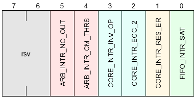

*Пример*: запись пакета данных **0x38** = **b0011_1000** в регистр **INTR_EN** включит активацию сигнала прерывания и запись в регистр статуса прерываний **INTR_STAT** данных для ошибок: **ARB_INTR_NO_OUT**, **ARB_INTR_CM_THRS**, **CORE_INTR_INV_OP**.     


## Операционные регистры

Все зарезервированные поля (**Reserved** или **rsv**) имеют тип доступа RO (Read Only).


### Таблица адресных пространств подмодулей

| Модуль                   | Адресное пространство |
|--------------------------|-----------------------|
| **Interrupt Controller** | 0x10-0x1F             |
| **Arbiter**              | 0xA0-0xAF             |
| **CORE**                 | 0xC0-0xCF             |
| **DATA**                 | 0xD0-0xDF             |
| **FIFO**                 | 0xF0 - 0xFF           |


### CORE

Базовый адрес регистров **CORE** – **CORE_BA** = **0xC0** 

| Регистр    | Смещение | Размер | Тип доступа | Бит   | Описание | Значение по сбросу |
|------------|----------|--------|-------------|-------|----------|--------------------|
| ECC_EN     | 0x00     | 1B     | RW          | [0]   | Включение/Отключение проверки и коррекции целостности данных<br><br>1 - Проверка включена<br>0 - Проверка выключена | 1'h1               |
|            |          |        | RO          | [7:1] | Reserved | 7'h00              |
| PREPROC_EN | 0x01     | 1B     | RW          | [0]   | Включение/Отключение предобработки данных<br />1 - Предобработка включена <br />0 - Предобработка выключена | 1'h1               |
|            |          |        | RO          | [7:1] | Reserved | 7'h00              |


### DATA registers

Базовый адрес **DATA** регистров – **DATA_BA** = **0xD0**

Количество **DATA** регистров - 16

| Регистры       | Смещение                 | Размер  | Тип доступа | Описание                     | Значение по сбросу |
|----------------|--------------------------|---------|-------------|------------------------------|--------------------|
| DATA_REGS [16] | 0x01 * [индекс регистра] | 1B X 16 | RW          | Регистры, значения которых используются в качестве данных, если операнд инструкции имеет тип "адрес" | 8'h0 |


### Arbiter

Базовый адрес регистров **Arbiter** – **ARB_BA** = **0xA0**
  
| Регистры               | Смещение | Размер          | Тип доступа   | Поле         | Бит   | Описание     | Значение по сбросу    |
|------------------------|----------|-----------------|---------------|--------------|-------|--------------|-----------------------|
| CONTROL                | 0x00     | 1B              | RW            | mode         | [1:0] | Изменение режима работы арбитра<br>0 - Арбитр отключен<br>1 - Последовательный<br>2 - Таргетированный<br>3 - Приоритетный | 2'h0                  |
|                        |          |                 | RO            | rsv          | [7:2] | Reserved     | 6'h00                 |
| ROUND_RULE_SET         | 0x01     | 1B              | RW            | func_mask    | [3:0] | Маскированное значение функции для фильтрации. Транзакции со значением функции, не совпадающим с маской, будут отброшены.<br>(см. [Программирование. Арбитр](#arbiter-1)) | 4'h0                  |
|                        |          |                 | RW            | cm_per_out   | [5:4] | Количество команд, обрабатываемое за одно переключение внутреннего указателя выхода.<br>0 - нефункциональное значение.<br>(см. [Программирование. Арбитр](#arbiter-1)) | 2'h1                  |
|                        |          |                 | RO            | rsv          | [7:6] | Reserved     | 2'h0                  |
| ROUND_RULE_STAT        | 0x02     | 1B              | RW            | stat         | [7:0] | Количество отброшенных команд.<br>Запись 0 - сброс статистики.<br>(см. [Программирование. Арбитр](#arbiter-1)) | 8'h0                  |
| ROUND_RULE_STAT_IRQ    | 0x03     | 1B              | RW            | stat_irq     | [7:0] | Количество отброшенных команд, при котором вызывается прерывание.<br>Поле stat после достижения данного значения продолжит штатную работу.<br>Запись 0 - прерывание не будет вызываться. | 8'h0                  |
| TARGET_RULE_0_SET      | 0x04     | 1B              | RW            | en           | [0]   | 1 - Правило активно<br>0 - Правило неактивно | 1'h0                  |
|                        |          |                 | RO            | rsv          | [3:1] | Reserved     | 3'h0                  |
|                        |          |                 | RW            | target_out   | [5:4] | Номер выхода команды.<br>3 - нефункциональное значение.<br>(см. [Программирование. Арбитр](#arbiter-1)) | 2'h3                  |
|                        |          |                 | RW            | fork_out     | [7:6] | Номер выхода копии команды.<br>3 - копирование не производится.<br>(см. [Программирование. Арбитр](#arbiter-1)) | 2'h3                  |
| TARGET_RULE_0_STAT     | 0x05     | 1B              | RW            | stat         | [7:0] | Количество успешно прошедших через правило команд.<br>Успешное прохождение определяется фактом передачи команды в выходное FIFO канала с номером target_out.<br>Запись 0 - сброс статистики. | 8'h0                  |
| TARGET_RULE_0_STAT_IRQ | 0x06     | 1B              | RW            | stat_irq     | [7:0] | Количество успешно прошедших через правило команд, при котором вызывается прерывание.<br>0 - прерывание не вызывается. | 8'h0                  |
| TARGET_RULE_1_*        | 0x07     |  *Структура*    | *регистров*   | *совпадает*  | *с*   | *регистрами* | *TARGET_RULE_0_**     |
| TARGET_RULE_2_*        | 0x0A     |  *Структура*    | *регистров*   | *совпадает*  | *с*   | *регистрами* | *TARGET_RULE_0_**     |
| PRIOR_RULE_SET         | 0x0D     | 1B              | RW            | prior_out    | [1:0] | Номер основного выхода команды.<br>3 - нефункциональное значение.<br>(см. [Программирование. Арбитр](#arbiter-1)) | 2'h3                  |
|                        |          |                 | RO            | reserved_out | [3:2] | Номер запасного выхода команды.<br>3 - резервирование не производится.<br>(см. [Программирование. Арбитр](#arbiter-1)) | 2'h3                  |
|                        |          |                 | RO            | rsv          | [7:4] | Reserved     | 4'h0                  |
| PRIOR_RULE_STAT        | 0x0E     | 1B              | RW            | stat         | [7:0] | Количество успешно прошедших через правило команд.<br>Успешное прохождение определяется фактом передачи команды в выходное FIFO канала с номером prior_out или reserved_out.<br>Запись 0 - сброс статистики. | 8'h0                  |
| PRIOR_RULE_STAT_IRQ    | 0x0F     | 1B              | RW            | stat_irq     | [7:0] | Количество успешно прошедших через правило команд, при котором вызывается прерывание.<br>0 - прерывание не вызывается. | 8'h0                  |


### FIFO

Базовый адрес регистров **FIFO** – **FIFO_BA** = **0xF0**

| Регистры   | Смещение | Размер  | Тип доступа | Поле     | Бит   | Описание                     | Значение по сбросу |
|------------|----------|---------|-------------|----------|-------|------------------------------|--------------------|
| FIFO_CLR   | 0x00     | 1B      | RW          | clear    | [0]   | Регистр очистки всех FIFO.<br>Запись 1 - производит очистку.<br>Чтение 0 - очистка произведена. | 1'h0               |
|            |          |         | RO          | rsv      | [7:1] | Reserved                     | 7'h00              |
| FIFO_DEPTH | 0x01     | 1B      | RW          | depth    | [3:0] | Установка глубины выходных FIFO<br>(см. [Программирование. FIFO](#fifo-1)) | 4'hF               |
|            |          |         | RO          | rsv      | [7:4] | Reserved                     | 4'h0               |
| FIFO_THRS  | 0x02     | 1B      | RW          | set_thrs | [3:0] | Установка порогового значение при котором срабатывает прерывание частичной заполненности выходных FIFO.<br>Если значение FIFO_THRS > FIFO_DEPTH, порог срабатывания прерывания становится равен FIFO_DEPTH. | 4'hF               |
|            |          |         | RO          | rsv      | [7:4] | Reserved                     | 4'h0               |
| FIFO_IN_EN | 0x0F     | 1B      | RW          | en       | [0]   |Запись 1 устанавливает внешний сигнал tready_s_o в 1.<br>Запись 0 устанавливает внешний сигнал tready_s_o в 0. | 1'h0               |
|            |          |         | RO          | rsv      | [7:1] | Reserved                     | 7'h00              |


### Interrupt controller

Базовый адрес регистров Interrupt controller – **INTR_BA** = **0x10**

| Регистр   | Смещение | Размер | Тип доступа | Описание | Значение по сбросу |
|-----------|----------|--------|-------------|----------|--------------------|
| INTR_STAT | 0x0      | 1 B    | RO          | Состояние активности всех прерываний в данный момент (подробнее в примере в разделе [описания работы контроллера прерываний](#описание-работы-контроллера-прерываний)) | 8'h0  |
| INTR_EN   | 0x1      | 1 B    | RW          | Активация отдельных прерываний. (подробнее в примере в разделе [описания работы контроллера прерываний](#описание-работы-контроллера-прерываний))            | 8'h3F |
| INTR_CLR  | 0x2      | 1 B    | WO          | Сброс отдельных прерываний. (подробнее в примере в разделе [описания работы контроллера прерываний](#описание-работы-контроллера-прерываний))            | -     |

*Напоминание* - структура всех INTR_* регистров ([графическое представление](#расположение-полей-типов-прерываний-в-регистрах-контроллера-прерываний)):

| Поле                 | Бит   |
|----------------------|-------|
| **FIFO_INTR_SAT**    | [0]   |
| **CORE_INTR_RES_ER** | [1]   |
| **CORE_INTR_ECC_2**  | [2]   |
| **CORE_INTR_INV_OP** | [3]   |
| **ARB_INTR_CM_THRS** | [4]   |
| **ARB_INTR_NO_OUT**  | [5]   |
| Reserved             | [7:6] |


## Программирование блока


### Действия для сброса или настройки блока

Для корректной работы блока необходимо:

1. Подать тактовый сигнал;
2. Подать активный сигнал сброса (активный уровень - низкий), который должен длиться минимум 2 такта;
3. Настроить все необходимые регистры. В последнюю очередь записать **1** в регистр **FIFO_IN_EN**. Только после этого можно передавать транзакции по интерфейсу **AXI-Stream**.

При необходимости реконфигурации необходимо:

1. Записать **0** в регистр **FIFO_IN_EN** для ограничения приёма новых данных;
2. Записать **1** в регистр **FIFO_CLR** записать для очистки всех FIFO;
3. Настроить нужные регистры;
4. Записать **1** в регистр **FIFO_IN_EN**, чтобы заново запустить приём данных.

При необходимости изменения значения поля **stat_irq** соответствующего регистра правила необходимо:

1. Записать **0** в регистр **FIFO_IN_EN** для ограничения приёма новых данных;
2. Записать **1** в регистр **FIFO_CLR** записать для очистки всех FIFO;
3. Записать **0** в поле **stat** соответствующего регистра правила;
4. Записать нужное значение в поле **stat_irq** соответствующего регистра правила;
5. Записать **1** в регистр **FIFO_IN_EN**, чтобы заново запустить приём данных.

В ином случае работа блока **непредсказуема**.


### Особенности программирования регистров

Общие правила получения сигнала ошибки (**PSLVERR**) на интерфейсе **APB**:

1. При обращении по адресу за пределами адресного пространства дизайна сигнал ошибки **PSLVERR** выставляется в высокий уровень;
2. При обращении в адресное пространство одного из подмодулей по неизвестному смещению сигнал ошибки **PSLVERR** выставлен не будет.

#### CORE

1. При отключении проверки целостности данных путем записи **0** в регистр **ECC_EN** входная инструкция проверяться на наличие ошибок не будет, исправление ошибок производится не будет, сигнализация о наличии ошибки **CORE_INTR_ECC_2** в **Interrupt Controller** происходить не будет;
2. При отключении предобработки путем записи **0** в регистр **PREPROC_EN** предобработка над данными не производится, операнды типа "адрес" не заменяются значениями из **DATA_REGS**, в выходной команде вместо данного значения будет изначальный адрес, дополненный нулями слева (например, **4'b1011** → **8'b000010111**).

#### FIFO

1. При попытке записи в регистр **FIFO_DEPTH** значения **'h0** фактическое значение в регистре не изменится.

#### Arbiter

Общее:

1. Если в поле **stat** соответствующего регистра любого правила записать **не 0**, то ничего не произойдет;
2. При **нулевом** значении регистра **CONTROL** все входящие команды будут отброшены без увеличения значения счетчиков статистики;
3. При заданном значении поля **stat_irq** соответствующего регистра для любого из правил и режимов работы прерывание будет установлено в **1** при выполнении условия stat &gt;= stat_irq.  
   Прерывание будет сброшено при выполнении одного из двух условий: произведена запись **0** в поле **stat** соответствующего регистра правила или подан активный внешний сброс. В ином случае даже при переполнении счетчика **stat** прерывание останется в **1**.

Round robin:

1. Поле **func_mask** регистра **ROUND_RULE_SET** и фильтрация работают следующим образом: в поле **func_mask** устанавливаются в **1** биты, которые должны присутствовать у входной инструкции в поле **func**.  
   Если все установленные биты есть, то команда проходит дальше. Если хотя бы один отсутствует, то команда отбрасывается.  
   Формула: passed = ((func_mask &amp; func) == func_mask).  
   Примеры:
   
   - func_mask = 4'b1111, func = 4'b0111 → команда отбрасывается;
   - func_mask = 4'b0101, func = 4'b1101 → команда проходит;
2. Если команда не проходит по фильтрации из п. 1, то состояние внутреннего счетчика Арбитра, отвечающего за переключение номера выхода, не будет изменено;
3. При попытке записи в поле **cm_per_out** регистра **ROUND_RULE_SET** значения **0** запись не будет произведена, а значение останется неизменным;
4. После записи в поле **cm_per_out** регистра **ROUND_RULE_SET** значения, **отличного от 0**, произойдет сброс непосредственно логики Round-robin арбитража, заключающийся в следующем:
   
   - Внутренний указатель номера выхода будет сброшен (будет указывать на выход с индексом 0);
   - Внутренний счетчик количества команд, которые осталось отправить на выходное FIFO до переключения выхода, будет сброшен (счет количества успешно прошедших в выходной буфер команд начнется заново).  
   На временной диаграмме при описании Round-robin режима показан как раз этот случай;

Target / Prior:

1. Если в поля **target_out** и **fork_out** регистра **TARGET_RULE_\*_SET** (**prior_out** и **reserved_out** регистра **PRIOR_RULE_SET**) записать одинаковое значение, то команды будут выходить только 1 раз по указанному номеру выхода;
2. Если в **target_out** / **prior_out** будет записано значение **3**, то все входящие команды будут отброшены. При записи в **fork_out** / **reserved_out** значения **3** копирование / переключение на запасной выход не будет осуществляться;
3. Если FIFO выхода с индексом, соответствующим значению поля **target_out** регистра **TARGET_RULE_\*_SET**, не может принять новую команду, то команда для выхода с индексом, соответствующим значению поля **fork_out** регистра **TARGET_RULE_\*_SET**, тоже будет отброшена;
4. Если FIFO выхода с индексом, соответствующим значению поля **prior_out** регистра **PRIOR_RULE_SET**, не может принять новую команду, то команда будет направлена на выход с индексом, соответствующим значению поля **reserved_out** регистра **PRIOR_RULE_SET**.  
   Далее:
   
   - Если FIFO выхода с индексом, соответствующим значению поля **reserved_out** регистра **PRIOR_RULE_SET**, может принять новую команду, то команда не будет отброшена, а соответствующее поле статистики инкрементируется;
   - Если FIFO выхода с индексом, соответствующим значению поля **reserved_out** регистра **PRIOR_RULE_SET**, не может принять новую команду, то команда будет отброшена.

#### Interrupt Controller

1. Попытка записи данных в регистр **INTR_STAT** игнорируется.
2. Попытка чтения данных регистра **INTR_CLR** игнорируется.
3. При записи **1** в регистр **INTR_CLR** необходимо учитывать, что из подмодуля Interrupt Controller нет обратной связи к подмодулям, вызывающим прерывания;  
   Следовательно, например, для подмодуля Арбитр необходимо сначала очистить поле **stat** соответствующего регистра правила, чтобы предотвратить повторное появление прерывания.


### Обработка прерываний

Сигнал прерывания, выставленный в высокий (активный) уровень, не предполагает остановки обработки данных, так как инструкции, вызывающие проблемы, будут отброшены.  
Прерывание можно сбросить с помощью записи в регистр **INTR_CLR**, не останавливая конвейер исполнения с помощью записи **0** в регистр **FIFO_IN_EN**.
