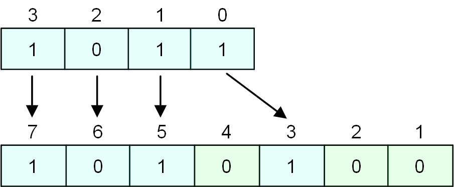
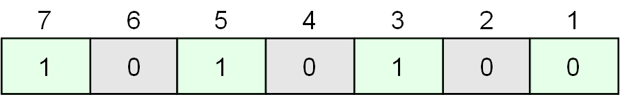
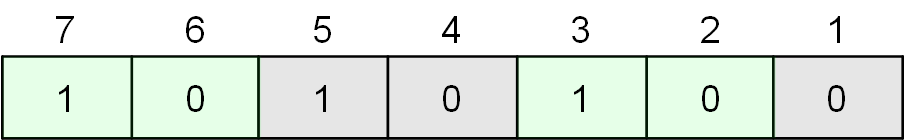
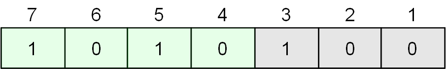

Опишем процесс расчёта кода коррекции ошибок по алгоритму Хэмминга (SEC-DED) на примере четырёхбитного сообщения 4'b1011 (далее - _изначальные данные_).

Для расчёта кода коррекции ошибок, требуется сформировать из изначальных данных кодовое сообщение.  
Формируется кодовое сообщение следующим образом:  
1) Выписываются биты данных подряд (от младшего индекса к старшему). Отсчет индексов в кодовом сообщении начинается **с единицы**, а не с нуля;  
2) Если позиция бита в кодовом сообщении является степенью двойки - вставляется ноль.

Далее считаются биты частичной чётности от определённых наборов позиций в кодовом сообщении.  
Первый бит частичной чётности рассчитывается от следующего набора позиций: 1, 3, 5, 7... - иными словами, начиная с первой (20) позиции берётся одна (20) позиция, одна (20) пропускается

(4'b1_1_1_0 → 1'b1)  
Второй бит частичной чётности считается от позиций: 2, 3, 6, 7... - начиная со второй (21) позиции берутся две (21) позиции, две (21) пропускаются.

(4'b1_0_1_0 → 1'b0)

Последующие биты частичной чётности считаются аналогичным образом, увеличивая степень двойки.

(4'b1_0_1_0 → 1'b0)

> **Расчёт бита чётности**  
> Если в наборе бит, используемых для расчета бита частичной чётности, общее число бит, равных единице **нечётное** - бит чётности равен единице, иначе - нулю.

Биты частичной чётности равны 3'b001.

После получения набора битов частичных чётностей требуется найти бит полной чётности от изначальных данных (4'b1011) и полученного набора битов чётности (3'b001).

Бит полной чётности равен 1'b0 (7'b001_1011 → 1'b0).

Полученный набор из битов частичной чётности и бита полной чётности является кодом коррекции ошибок.

Для проверки целостности данных с помощью кода коррекции ошибок требуется вычислить бит общей чётности от **полученных** данных и **полученных** битов частичной чётности, а также провести процедуру вычисления битов частичной чётности заново.  
Если **полученный** бит полной чётности не совпадает с **вычисленным** - в наше сообщение попала ошибка (или нечётное количество ошибок).  
Если выполнить побитовое исключающее ИЛИ от **полученного** и **вычисленного** набора битов частичной чётности - получим позицию ошибки, НО НЕ В ИЗНАЧАЛЬНЫХ ДАННЫХ, А В КОДОВОМ СООБЩЕНИИ.  
Если биты полной чётности совпадают, а позиция ошибки не равна нулю - в наших данных две ошибки, мы НЕ можем их восстановить.  
Но если позиция ошибки НЕ равна нулю, и биты полной чётности НЕ совпадают - в данных присутствует одна ошибка, её можно исправить.

Подробный пример проверки данных по алгоритму Хэмминга приведён в прикреплённой таблице **ECC_Example.xlsx**
