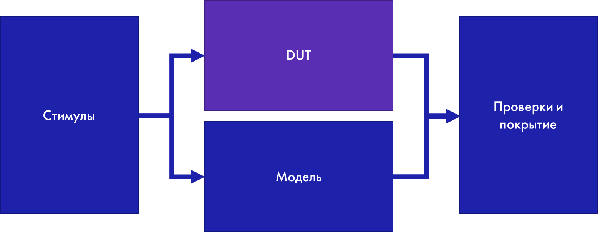
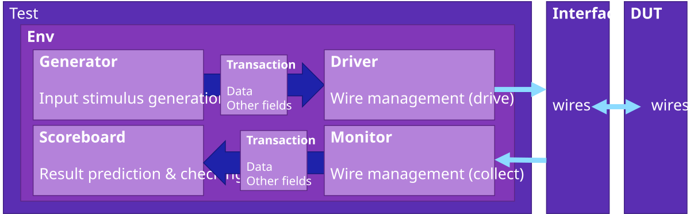

## Что такое ООП
ООП — методология программирования, основанная на представлении программы в виде совокупности взаимодействующих объектов, каждый из которых является экземпляром определённого типа (класса);
* В отличии от процедурного программирования, оперирующего действиями, ООП оперирует объектами реального мира (геометрическая фигура, тест, транзакция, список);
* Поведение объектов и их функциональные возможности описываются в классах;
* Основные принципы:
  * Абстракция;
  * Инкапсуляция;
  * Наследование;
  * Полиморфизм.
  
## Абстракция
* Определение набора сущностей, которыми будут оперировать в рамках решения задачи;
* Для каждой сущности тематическое выделение самых важных её характеристик и объединение их в класс.
#### Пример:
```
Класс: Геометрическая фигура
----------
Свойства:
* семество фигуры
* площадь
* количество сторон
----------
Методы:
* нарисовать фигуру
* рассчитать площадь
```
#### Профит:
* Позволяет разбить разработку на подзадачи
* Повышает читабельность кода

## Наследование и полиморфизм
* Дочернии классы перенимают все свойства и методы их родителя;
* Дочерние классы могут переопределять методы родителя.
#### Пример:
```
Класс: Треугольник наследуется от Геометрической фигуры
----------
Наследуемые свойства:
* семество фигуры
* площадь
* количество сторон
----------
Наследуемые методы:
* нарисовать фигуру
----------
Переопределенные методы:
* рассчитать площадь
```
#### Профит:
* Позволяет разбить разработку на подзадачи;
* Использование проверенных решений (реюз);
* Коллективная разработка.
## Инкапсуляция
* Размещение свойств и методов в классе с определением политики доступа;
* Политики инкапсулирования:
  * публичный доступ;
  * доступ только для данного класса;
  * доступ только внутри данного класса и его наследников.
#### Пример:
```
Класс: Геометрическая фигура
----------
Свойства:
* семество фигуры
* площадь -> доступ только внутри класса и его наследников
* количество сторон
----------
Методы:
* нарисовать фигуру
* рассчитать площадь -> публичный доступ
```
#### Профит:
* Безопасный код (с точки зрения переиспользования и расширения)

## Почему ООП полезно для верификации
* Для всех базовых процедурных шагов верификации – формирование тестовых воздействий, наблюдение, проверка – мы можем составить абстрактные модели;
* Это позволит масштабировать процесс верификации для блоков разной сложности;
* Можно писать базовые тесты и наследовать общие воздействия в новых тестах, лишь уточняя детали.
## Классы в SystemVerilog
Основные особенности:
* Экземпляры классов объявляются в теле подпрограмм, модулей, и других классов;
с точки зрения компьютера формальное имя класса является адресом (ссылкой) ячейки памяти, в которой будет размещен объект класса. При простом объявлении экземпляра класса, ссылка указывает в никуда (null), т.е. объекта не существует;
* Для создания класса необходимо вызвать его конструктор;
* Каждый класс имеет конструктор, но не имеет деструктора, т.к. стандарт предписывает реализацию «сборщика мусора» - инструмента по уничтожению лишних объектов;
* Cсылки на объекты классов можно присваивать друг другу и передавать как аргументы функций;
* При передаче объекта как аргумента функции, передаётся его ссылка, а значит любое изменение любого свойства внутри этой функции отразится на реальном объекте вне функции;
* Для того чтобы изменить ссылку класса внутри функции, необходимо передавать класс по ссылке;
* Для того, чтобы создать копию класса, необходимо явно создать новый объект и переписать в него свойства копируемого объекта.

## Наследование в SystemVerilog
* В System Verilog полностью реализовано единственное наследование (single inheritance) с помощью ключевого слова ```extends```;
* Ссылке на объект родительского класса мы можем присваивать ссылку на объект дочернего, но не наоборот. В обратную сторону необходимо использовать функцию ```$cast()```.
## Полиморфизм в SystemVerilog
* Абстрактные классы (не имеющие экземпляров), виртуальные методы и параметризация классов реализуют полиморфизм в SystemVerilog;
* Виртуальные методы родительских классов могут переопределяться в наследниках;
* Виртуальные методы родителей могут быть расширены (дописаны) в наследнике. Для этого необходимо вызвать этот метод через родителя: ```super.needed_method()```;
* При присвоении объекту родительского класса ссылки на дочерний класс объект родительского класса перенимает реализации методов дочернего класса;
* Параметризация класса позволяет писать статические шаблоны классов.
## Инкапсуляция в SystemVerilog
* ```static``` метод – доступен для вызова без явного существования объекта, не может изменять нестатические свойства класса;
* ```static``` свойство – доступно без явного существования объекта и для каждого объекта имеет одно и тоже значение всегда. Является общим;
* ```protected``` метод/свойство – не доступно для вызова пользователем (нельзя обратиться через экземпляр объекта). такие свойства доступны только внутри самих объектов и их наследников;
* ```local``` метод/свойство – доступно только внутри данного класса и недоступно пользователю и его наследникам.

## Различные подходы к разработке testbench
### Что из себя представляет testbench?

#### Стимулы
* Последовательность тестовых воздействий на дизайн:
  * Тактовые сигналы, сбросы;
  * Шины данных, адресов;
* Описание взаимозависимостей различных групп воздействий.
#### Модель
* Расчёт референсных значений на выходах дизайна исходя из оказанных на него воздействий:
  * Моделирование памяти внутри дизайна;
  * Расчёт преобразований, произведённых над принятыми данными;
  * Предсказание реакции дизайна на воздействия: прерывания, выбор порта для выхода данных и т.д.
#### Проверки и покрытие
* Сравнение данных, полученных из DUT и модели, сбор покрытия


### Simple HDL testbench
* Генерация тактового сигнала:
```SystemVerilog
always #5 clk = ~clk;
```
* Генерация сигнала сброса:
```SystemVerilog
initial begin
  $display("Started test");
  #5 rst_n = 1;
end
```
* Генерация входных данных:
```SystemVerilog
repeat(20) begin
  _op1 = $urandom;
  _op2 = $urandom;
  _op_type = $urandom;
  do_operation(_op1, _op2, _op_type);
end
```
* Передача сигналов между тестируемым устройством и тестбенчем:
```SystemVerilog
task do_operation(bit[3:0] m_op1, bit[3:0] m_op2, bit m_op_type);
  @(posedge clk);
  op1 <= m_op1;
  op2 <= m_op2;
  op_type <= m_op_type;
  req_valid <= 1;
  @(posedge clk);
  req_valid <= 0;
  @(posedge rsp_valid);
...
```
* Сравнение полученных данных с эталонными:
```SystemVerilog
...
  bit [4:0] expected_res;
  bit expected_error;
  
  expected_error = ((m_op1 < m_op2) && m_op_type);
  expected_res = (m_op_type ? (m_op1 – m_op2) : (m_op1 + m_op2));

  if(error != expected_error)
    $error("Unexpected error value!");
  if(~error)
    if(res != expected_res)
      $error("Unexpected res value!");
endtask
```

#### Преимущества:
* Делается мгновенно и «на коленке»;
* Можно быстро отловить баги, вызванные опечатками, например, неподключенные тактовые сигналы и сбросы;
* Может быть синтезируемым, если в этом есть необходимость.

#### Недостатки:
* Практически невозможно хорошо структурировать;
* Вертикальная интеграция невозможна;
* Переиспользование сводится исключительно к копированию частей одного верификационного окружения в другое;
* Сложно писать стимулы для сложных дизайнов с различными портами;
* Больше подходит для направленного тестирования. Constrained random подход реализовать трудоёмко.
### Bus Functional Model testbench
```SystemVerilog
module tb_top;

  bit clk, rst_n, op_type, req_valid, rsp_valid, error;
  bit [3:0] op1, op2;
  bit [4:0] res;

  calc dut (clk, rst_n, op_type, req_valid, op1, op2, res, rsp_valid, error);

  clk_gen  clk_bfm(clk);
  rst_gen  rst_bfm(rst_n);
  data_chk checks(clk, rst_n, op_type, req_valid, rsp_valid, error, op1, op2, res);
  data_gen data_bfm(op_type, req_valid, op1, op2);

  initial clk_bfm.start_clk(5);

  initial begin
    rst_bfm.do_rst(5);
    fork
      data_bfm.do_operations(20);
      checks.start_monitoring();
    join_any
  end

endmodule
```
* Непосредственно модуль тестбенча содержит в себе только соединения проводов, инстансы DUT, BFM и чекера и вызовы их методов;
* Вся реализация методов скрыта внутри вложенных модулей;
* Модули представляют собой логически завершённые блоки, выполняющие определённый заранее функционал:
  * Генерация тактового сигнала;
  * Генерация сигнала сброса;
  * Генерация входных данных;
  * Сравнение полученных данных с эталонными.
#### Преимущества:
* Можно собрать всё так же быстро и легко, как и простейший тестбенч;
* При наличии обширной библиотеки BFM можно проверять достаточно широкий функционал;
* Тестовые сценарии выглядят не такими громоздкими, благодаря инкапсуляции большей части функционала внутрь BFM;
* Может быть синтезируемым, если в этом есть необходимостью.

#### Недостатки:
* Вертикальная интеграция невозможна;
* Единственная переиспользуемая часть – BFM;
* Сложно писать стимулы для сложных дизайнов с различными портами;
* Constrained Random* тесты сделать уже проще, чем в предыдущем варианте, но всё ещё сложнее, чем в следующих.

\* – Constrained Random подход (тестирование с ограниченной случайностью) автоматизирует создание тестовых воздействий выбирая случайные из множества интересных нам значений.
### Object-oriented testbench



Например, механизм воздействия на тестируемое устройство можно разделить на две составляющие – класс транзакции, содержащий адрес и данные, и класс драйвера, который отправит значения по интерфейсу.

Транзакция:
```SystemVerilog
class transaction();
  bit[`ADDR_W-1:0] address;
  bit[`DATA_W-1:0] data;
endclass
```

Драйвер (!пример):
```SystemVerilog
class driver();
  virtual interface_type vif;
  task drive_trans (transaction trans)
    @(posedge vif.clk);
    vif.valid   <= 1;
    vif.data    <= trans.data;
    vif.address <= trans.address;
    @(posedge vif.clk);
    vif.valid <= 0;
  endtask
endclass
```

Агент:
```SystemVerilog
class agent();
  transaction trans;
  driver      drv;
…
  task main();
    drv.drive_trans(trans);
  endtask
…
endclass
```

Некоторые особенности:
* Для связки статической части тестбенча с динамической используется паттерн проектирования – виртуальный интерфейс. Объекты не могут иметь внутри себя статические сущности – модули и интерфейсы, но могут иметь ссылки на них. Virtual interface это и есть такая ссылка;
* При создании объектов необходимо вызвать конструктор – функцию new(). А при описании классов эту функцию можно кастомизировать в зависимости от наших намерений;
* Для связки объектов между собой следует использовать mailbox. Функционал очевиден из говорящего названия: один объект что-то кладёт в него, другой это достаёт. Для работы этого механизма нужно создать mailbox в одном объекте и раздать ссылки на него всем объектам, которые участвуют в обмене данными;
* Для удобства отладки в классах можно описать функцию display(), которая будет в удобном формате выводить необходимую информацию в лог.

#### Преимущества:
* Широкие возможности для переиспользования и вертикальной интеграции;
* Удобно структурировать;
* Идеально для Constrained Random подхода;
* Гибкость для разработки сложных стимулов и их синхронизации между собой;
* Объектно-ориентированный подход даёт возможность разрабатывать структуры в более human-friendly виде;
* Повышение уровня абстракции ускоряет разработку.

#### Недостатки:
* Большие трудозатраты на первоначальную разработку;
* Требуется много времени (или денег) на разработку (или покупку) переиспользуемой кодовой базы;
* Требуется хорошо продумать архитектуру «на берегу», иначе можно получить вместо тестбенча набор классов, который перечеркнёт все вышеописанные преимущества;
* Не может быть синтезируемым.