# Методические материалы

## Навигация по проекту
```
./hack-2026/
    ./dut_protected/                                     – исходный код проверяемого RTL
        ./N/dut                                          – где N номер DUT с багом
            ./axi_stream_decoder_top.svp
    ./tb/                                      – исходный код тестового окружения
        ./apb_master_vc/                           – верификационный компонент APB протокола
            ./apb_master_agent.sv                      – ведущий агент APB протокола
            ./apb_master_agent_if.sv                   – интерфейс APB протокола
            ./apb_master_driver.sv                     – драйвер APB протокола
            ./apb_master_monitor.sv                    – монитор APB протокола
            ./apb_master_transaction.sv                – класс транзакции агента APB протокола
        ./axis_vc/                                 – верификационный компонент AXI-stream протокола
            ./axis_master_vc/                          – ведущий верификационный компонент AXI-stream протокола
                ./axi_stream_master_agent.sv               – ведущий агент AXI-stream протокола
                ./axi_stream_master_driver.sv              – драйвер ведущего агента AXI-stream протокола
            ./axis_slave_vc/                           – ведомый верификационный компонент AXI-stream протокола
                ./axi_stream_slave_agent.sv                – ведомый агент AXI-stream протокола
                ./axi_stream_slave_driver.sv               – драйвер ведомого агента AXI-stream протокола
            ./axi_stream_agent_if.sv                   – интерфейс AXI-stream протокола
            ./axi_stream_monitor.sv                    – монитор AXI-stream протокола
            ./axi_stream_transaction.sv                – класс транзакции AXI-stream протокола
        ./clk_vc/                                  – верификационный компонент тактирования
            ./clk_agent.sv                             – агент тактирования
            ./clk_agent_if.sv                          – интерфейс тактирования
            ./clk_driver.sv                            – драйвер тактирования
            ./clk_transaction.sv                       – класс транзакции тактирования
        ./irq_vc/                                  – верификационный компонент прерывания
            ./irq_agent.sv                             – агент прерывания
            ./irq_agent_if.sv                          – интерфейс прерывания
            ./irq_monitor.sv                           – мониитор прерывания
            ./irq_transaction.sv                       – класс транзакции прерывания
        ./rst_vc/                                  – верификационный компонент сброса
            ./rst_agent.sv                             – класс агента сброса
            ./rst_agent_if.sv                          – интерфейс сброса  
            ./rst_driver.sv                            – драйвер сброса
            ./rst_monitor.sv                           – монитор сброса
            ./rst_transaction.sv                       – класс транзакции сброса
        ./axis_decoder_defines.sv                          – некоторые константны
        ./axis_decoder_env.sv                              – класс окружения, содержит агенты (должен быть дополнен)
        ./axis_decoder_env_if.sv                           – интерфейс между тестовым окружением и DUT'ом
        ./axis_decoder_pkg.sv                              – содержит определения типов (может быть дополнен)
        ./axis_decoder_scoreboard.sv                       – класс проверки результатов, должен содержать модель проверяемого дизайна
        ./axis_decoder_tb_top.sv                           – модуль верхнего уровня, здесь подключается DUT и создается тест
        ./test/                                  – классы тестов
            ./axis_decoder_arbiter_base_test.svp
            ...

    ./run.sh                                       - скрипт для запуска локальной симуляции
    ./tb_files.lst                                 - список файлов-исходников
    ./tests.lst                                    - список тестов, запускаемых при тестировании на CI 
```

# Запуск
### Предварительно загрузить XCELIUM:
(Вставить текст в терминал на колесико мыши)
```
module load cadence/XCELIUMMAIN/22.03
```

Убедитесь, что создали и экспортировали переменную GIT_HOME:

```
export GIT_HOME=/home/*login*/*path_to_hack-2026*
```

### Команда для запуска:

```
$GIT_HOME/run.sh
```

В самом скрипте `run.sh` есть параметр ```<testname>```, указывающий какой тест выполнить (можно указать и несколько, все). Не забывайте его менять при необходимости.

# Отладка
**Имеет смысл смотреть на первое сообщение об ошибке (\*E или \*F) в логе.** \
Сообщение об ошибке имеет следующую структуру:

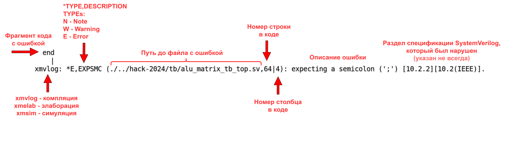

Некоторые типовые ошибки:
* Отсутствие точки с запятой в конце строки:
```
    join_none
            |
xmvlog: *E,EXPSMC (./../hack-2026/tb/apb_master_vc/apb_master_agent.sv,31|12): expecting a semicolon (';') [10.2.2][10.2(IEEE)].

```
* Тоже отсутсвие точки с запятой в конце строки, но после объявления задачи/функции: ```task task_name();```
```
    fork
       |
xmvlog: *E,EXPKWS (./../hack-2026/tb/apb_master_vc/apb_master_agent.sv,28|7): Expecting port direction keyword 'input', 'output', 'inout', or 'ref'.
```
* Тип использован до объявления (скорее всего пропущен соответствующий `include "file.sv"):
```
  apb_master_driver  driver;
                  |
xmvlog: *E,NOIPRT (./../hack-2026/tb/apb_master_vc/apb_master_agent.sv,11|18): Unrecognized declaration 'apb_master_driver' could be an unsupported keyword, a spelling mistake or missing instance port list '()' [SystemVerilog].
```
* Отстутсвует ``` `endif``` в конце файла после соответствующего ``` `ifndef```, защищающие содержимое от повторного включения:
```
`endif // !AXIS_DECODER_TB_TOP
                            |
xmvlog: *E,EOFICD (./../hack-2026/tb/axis_decoder_tb_top.sv,68|28): EOF found within `ifdef (@ ./tb/axis_decoder_tb_top.sv,1|6) compiler directive [16.4(IEEE)].
```
* Классу был передан статический интерфейс, а не ссылка (virtual): ```function new(virtual apb_master_agent_if apb_if, mailbox mon_outside);```
```
  function new(apb_master_agent_if apb_if, mailbox mon_outside);
                                 |
xmvlog: *E,SVNOTY (./../hack-2026/tb/apb_master_vc/apb_master_agent.sv,16|33): Syntactically this identifier appears to begin a datatype but it does not refer to a visible datatype in the current scope.
```
* Обращение по пустой ссылке (экземпляр класса объявлен, но не создан): ```example_name = new;```
```
xmsim: *E,TRNULLID: NULL pointer dereference.
          File: ./tb/apb_master_vc/apb_master_agent.sv, line = 29, pos = 12
         Scope: worklib.$unit_0x3d959e2d::apb_master_agent::main
          Time: 0 FS + 0
```

* Экземпляр класса объявлен не в начале begin-end блока:

Неправильно:
```SystemVerilog
          forever begin
            some_code_before();
            axi_stream_transaction transaction;
            transaction = new();
            ...
```
Правильно:
```SystemVerilog
          forever begin
            axi_stream_transaction transaction;
            transaction = new();
            some_code_after();
            ...
```
Сообщение об ошибке:
```
            axi_stream_transaction transaction;
                                             |
xmvlog: *E,MISEXX (./../hack-2026/tb/axis_vc/axi_stream_monitor.sv,44|45): expecting an '=' or '<=' sign in an assignment [9.2(IEEE)].
```

# Отладка (GUI)

Справка:
```
module load cadence/XCELIUMMAIN/22.03;
cdnshelp
```
### Основные функциональные окна:
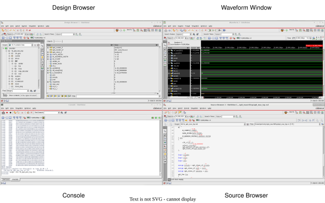

* Design Browser – отображает иерархию проекта;
* Waveform Window – отображает выбранные сигналы в виде временных диаграмм;
* Console – отображает логи и ошибки симуляции, также как в терминале;
* Source Browser – отображает исходный код, а также значения переменных в процессе симуляции,
* Expression Calculator – позволяет добавлять сигналы, соответсвующие некоторому выражению.

#### Кнопки вызова окон:

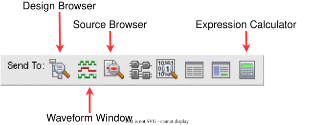

#### Или через Design Browser:

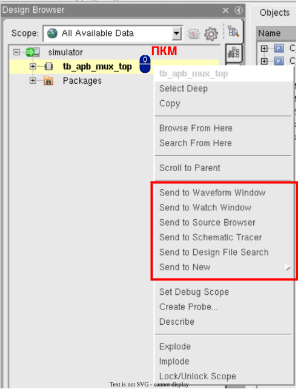

### Работа с Waveform Window:

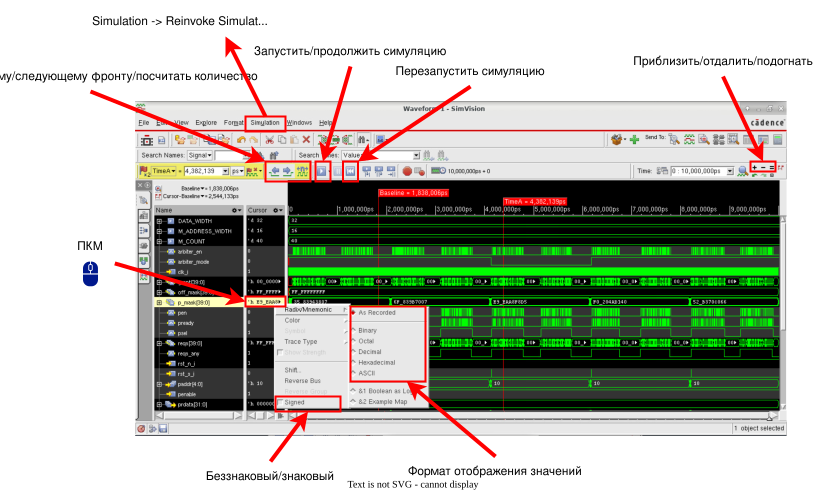

### Работа с базой данных
1. Создание дампа:

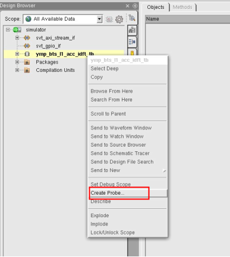

2. Сохранение:

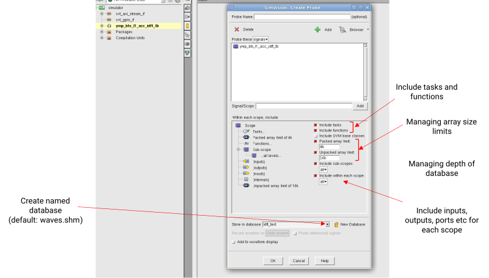

3. Загрузка:

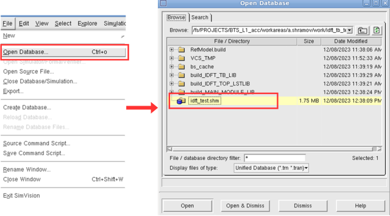

4. Результат (временная диаграмма сохранена, не требуется повторное симулирование):

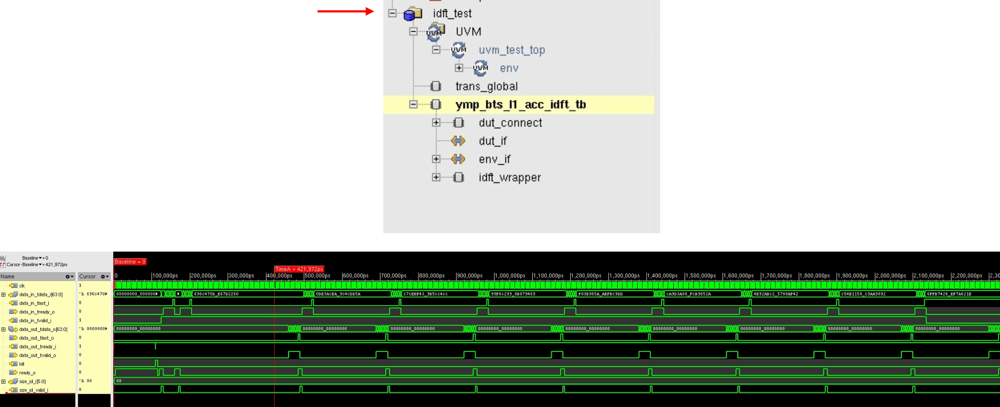

### Точки останова (Breakpoints)

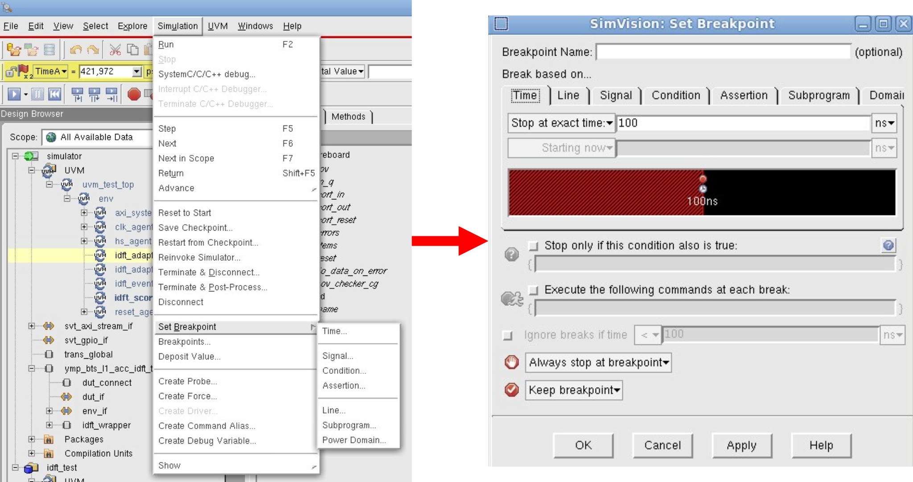

Точка останова по временному интервалу, изменению сигнала, выполнению определенной строки, условная точка останова.
### Выражения (Expressions)
1. Создание (выбрать нужные сигналы):

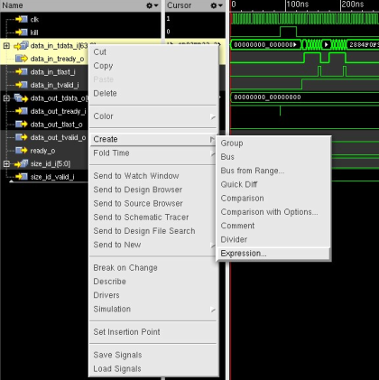

2. Описать выражение:

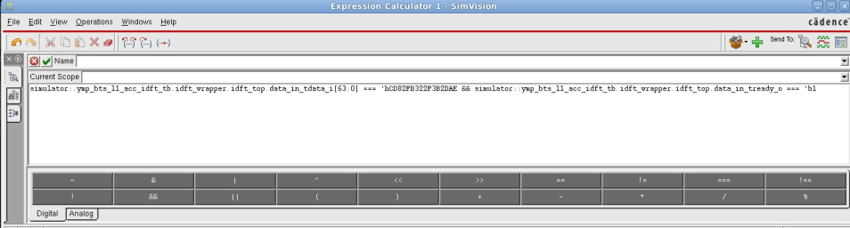

3. Результат (добавлен сигнал результата выражения):

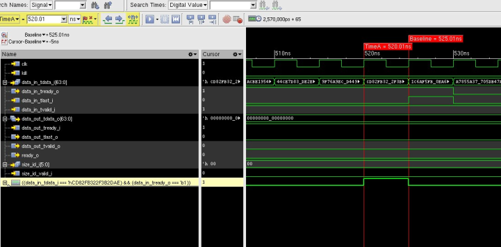

### Сравнение (Comparison)
1. Создание (выбрать сигналы для сравнения):

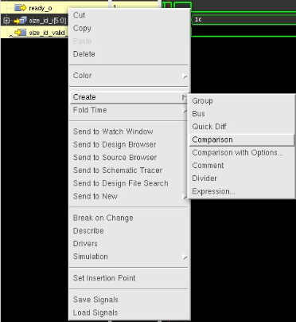

2. Результат (отмечены области, в которых сигналы не равны):

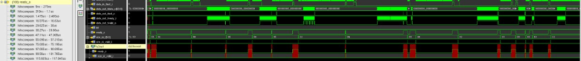

