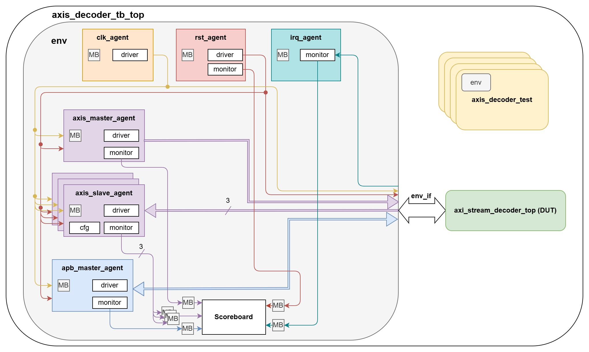
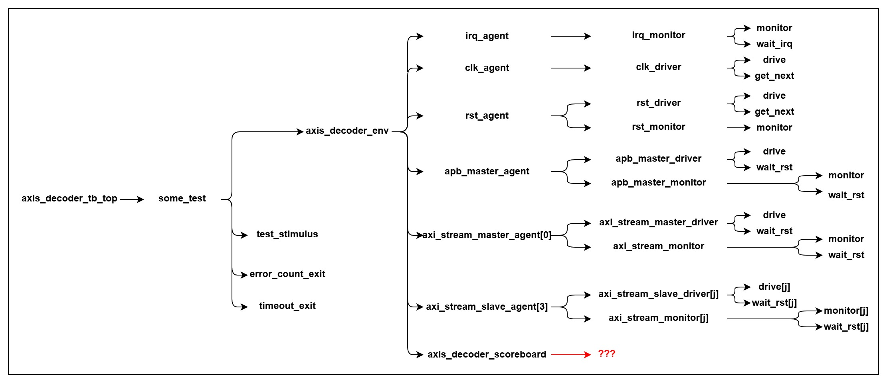
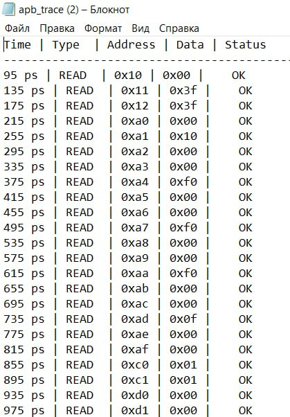
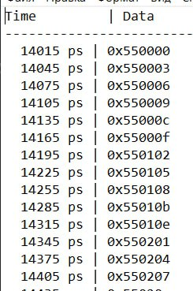

# Принципы работы тестового окружения (Testbench working principles)

## Оглавление

- [Принципы работы тестового окружения (Testbench working principles)](#принципы-работы-тестового-окружения-testbench-working-principles)
  - [Оглавление](#оглавление)
  - [Назначение документа](#назначение-документа)
  - [Справка](#справка)
  - [Структурная схема тестового окружения](#структурная-схема-тестового-окружения)
  - [Принципы работы тестового окружения](#принципы-работы-тестового-окружения)
    - [Модуль axis\_decoder\_tb\_top](#модуль-axis_decoder_tb_top)
    - [axis\_decoder\_tests](#axis_decoder_tests)
    - [Класс axis\_decoder\_env](#класс-axis_decoder_env)
    - [Класс axis\_decoder\_scoreboard](#класс-axis_decoder_scoreboard)
    - [Классы агентов clk\_agent, rst\_agent, apb\_master\_agent, axi\_stream\_master\_agent, irq\_agent и axi\_stream\_slave\_agent](#классы-агентов-clk_agent-rst_agent-apb_master_agent-axi_stream_master_agent-irq_agent-и-axi_stream_slave_agent)
    - [Классы драйверов clk\_driver, rst\_driver, apb\_master\_driver, axi\_stream\_master\_driver и axi\_stream\_slave\_driver](#классы-драйверов-clk_driver-rst_driver-apb_master_driver-axi_stream_master_driver-и-axi_stream_slave_driver)
    - [Классы мониторов rst\_monitor, apb\_master\_monitor, irq\_monitor, axi\_stream\_monitor](#классы-мониторов-rst_monitor-apb_master_monitor-irq_monitor-axi_stream_monitor)
    - [Графическое изображение запускающихся потоков](#графическое-изображение-запускающихся-потоков)
    - [Трассировка интерфейсов](#трассировка-интерфейсов)

## Назначение документа

Документ описывает принципы работы тестового окружения для блока AXI-S Decoder.


## Справка

Изучение данного документа подразумевается после ознакомления с материалом [описания тестового окружения](./testbench_description.md).


## Структурная схема тестового окружения

Для удобства - [иерархия файлов](./methodics_and_guides.md#навигация-по-проекту) и схема:



## Краткое описание компонентов тестового окружения

| Название                      | Описание                                                     | Примечания                                                   |
| ----------------------------- | ------------------------------------------------------------ | ------------------------------------------------------------ |
| `axis_decoder_tb_top`         | Верхний уровень тестбенча. Содержит в себе объект класса окружения (`axis_decoder_env`), DUT, тесты и обеспечивает связь между ними: DUT и окружение - через интерфейс `env_if`, который содержит в себе интерфейсы всех агентов; окружение и тесты - через дескриптор объекта класса окружения`env` | -                                                            |
| `axis_decoder_tests`          | Описание подаваемых в DUT входных стимулов, заключающееся в последовательном создании транзакции, ее заполнении и передачи в соответствующий mailbox | `timeout_us` — таймаут для завершения симуляции. При превышении времени вызывает `$fatal`<br>`max_error_count` — максимально допустимое количество ошибок (задается в run.sh). прерывание симуляции при достижении |
| `axi_stream_decoder_top(DUT)` | Проверяемый дизайн. Подключается к окружению через интерфейс `env_if` | -                                                            |
| `env_if`                      | Интерфейс окружения. Связующий элемент между DUT и окружением. Содержит в себе интерфейсы всех агентов | -                                                            |
| `axis_decoder_env`            | Класс окружения. Содержит в себе все остальные верификационные компоненты и обеспечивает связь между ними | **События:**<br>`first_hs` фиксирует первый handshake на интерфейсах AXI-stream<br>**Mailbox:**<br>- `rst2scrb` — передаёт транзакции из rst_agent в scoreboard<br>- `in2scrb` — передаёт транзакции от AXI-stream master-агентов в scoreboard<br>- `out2scrb` — передаёт транзакции от AXI-stream slave-агентов в scoreboard<br>- `apb2scrb` — передаёт APB-транзакции из apb_master_agent в scoreboard<br>-  `irq2scrb` - передаёт irq-транзакции из монитора irq_agent в scoreboar |
| `irq_agent`                   | Мониторит прерывания                                         | -                                                            |
| `clk_agent`                   | Отвечает за генерацию тактового сигнала, который далее подается в DUT и во все остальные верификационные компоненты (кроме `clk_vc`, `rst_vc`) | -                                                            |
| `rst_agent`                   | Отвечает за генерацию сигнала сброса, который далее подается в DUT и во все остальные верификационные компоненты (кроме `clk_vc`, `rst_vc`) | -                                                            |
| `axis_master_agent`           | Отвечает за передачу транзакций в роли master через AXI-stream подобный интерфейс `axis_in_if[AXIS_DECODER_AXI_MS_NUM]` в DUT, а также мониторит шину, передавая наблюдаемые транзакции в `Scoreboard` | -                                                            |
| `axis_slave_agent`            | Отвечает за передачу транзакций в роли slave через AXI-stream подобный интерфейс `axis_out_if[AXIS_DECODER_AXI_SL_NUM]` в DUT, а также мониторит шину, передавая наблюдаемые транзакции в `Scoreboard` | -                                                            |
| `apb_master_agent`            | Отвечает за передачу транзакций через APB подобный интерфейс `apb_if` в DUT, а также мониторит шину, передавая наблюдаемые транзакции в `Scoreboard` | -                                                            |
| `Scoreboard`                  | Служит для проверки функциональных характеристик блока       | \- `error_count` — счетчик обнаруженных ошибок.<br/>\- `apb_trans_count` — счетчик обращений по интерфейсу APB.<br/>\- `shutdown()` — метод, который вызывается перед завершением каждого теста.<br/>\- `scrb_task_job` — переменная, которая указывает на активный scoreboard процесс и даёт доступ к его управлению в классах тестов. |

## Параметры конфигурации тестового окружения

| Название                | Значение по умолчанию | Описание                                               |
| ----------------------- | --------------------- | ------------------------------------------------------ |
| AXI_DATA_I_W            | 32                    | Ширина входной шины TDATA интерфейса AMBA AXI4-Stream  |
| AXI_DATA_O_W            | 24                    | Ширина выходной шины TDATA интерфейса AMBA AXI4-Stream |
| APB_ADDR_W              | 8                     | Ширина шины PADDR интерфейса AMBA APB3                 |
| APB_DATA_W              | 8                     | Ширина данных APB шины                                 |
| AXIS_DECODER_AXI_SL_NUM | 3                     | Количество slave агентов AXI-stream                    |
| AXIS_DECODER_AXI_MS_NUM | 1                     | Количество master  агентов AXI-stream                  |

Компоненты непараметризуемы

```diff
- МЕНЯТЬ УСТАНОВЛЕННЫЕ ЗНАЧЕНИЯ ЗАПРЕЩЕНО, ОНИ УКАЗАНЫ ИСКЛЮЧИТЕЛЬНО ДЛЯ ОЗНАКОМЛЕНИЯ -
```

Перечисленные в таблице параметры находятся в файле *`axis_decoder_defines.sv`*.

## Принципы работы тестового окружения

В данном разделе разобраны принципы работы всего тестового окружения, начиная с самого верхнего уровня.

### Модуль axis_decoder_tb_top

Модуль `axis_decoder_tb_top` является верхним уровнем всего проекта. В нем содержатся всего четыре сущности: интерфейс окружения (`axis_decoder_env_if env_if`), окружение (`axis_decoder_env env`), тесты и проверяемый дизайн (`axi_stream_decoder_top top`).

Обратите внимание, что перед объявлением самого топового модуля указаны включения файлов проекта через ``` `include```. Это необходимо для успешной сборки проекта перед симуляцией.

DUT уже подключен к окружению через интерфейс `env_if`. При запуске симуляции выполняется код внутри блока `initial begin..end`: устанавливается формат вывода времени с помощью [$timeformat](https://www.chipverify.com/verilog/verilog-timeformat), создаются объекты классов окружения и тесты, а затем вызывается функция запуска теста `run()`:

```SystemVerilog
initial begin
  // Set time format
  $timeformat(-12, 0, " ps", 10);

  if ($test$plusargs("SOME_TEST")) begin
    // Creating environment
    env = new(env_if);

    // Creating test
    some_test = new(env);
    some_test.test_name = "SOME_TEST";
    
    // Calling run of test
    some_test.run();
    
    // waiting end simulation
    wait(some_test.end_of_test_env.triggered);
  end
end
```

---

### axis_decoder_tests

Классы тестов запротекчены, в них есть все необходимые сервисные потоки для завершения симуляции в случаях: 1) слишком долгой симуляции (время симуляции превысило определенное значение), в этом случае симуляция завершится с выводом сообщения `"SIMULATION TIME EXCEEDED! Exiting..."`; 2) по достижению максимального допустимого количества ошибок, в этом случае симуляция завершится с выводом сообщения `"MAXIMUM ERROR COUNT REACHED! Exiting..."`. 

В случае ввода в скрипте `run.sh` или в строке запуска (о ней можно узнать [здесь](./methodics_and_guides.md#запуск)) название теста в консоли будет выводиться сообщение `"<TEST_NAME> RUN <simulation_time"`
где:

- <TEST_NAME> — имя запущенного теста (например, TEST_ADDR, TEST_ID и т.д.),
- <simulation_time> — текущее время симуляции в формате $realtime.

---

С описанием предоставленных тестов и сценариев можно ознакомиться [здесь](./verification_plan.md#Тестовые-сценарии)

### Класс axis_decoder_env

Класс является описанием окружения, включающего в себя все остальные верификационные подкомпоненты: агенты и скорборд.

При вызове функции `new()` (из `axis_decoder_tb_top`) локальной переменной интерфейса окружения присваивается полученный дескриптор интерфейса окружения и последовательно вызывается создание mailbox-ов и всех остальных верификационных подкомпонентов с передачей им аргументов - интерфейсов агентов, mailbox-ов и event.

```SystemVerilog
// Constructor
  function new(virtual axis_decoder_env_if vif);

    this.vif                 = vif;

    // Creating mailboxes
    this.rst2scrb            = new();
    this.apb2scrb            = new();
    this.irq2scrb            = new();

    // Creating agents
    foreach (axis_master_agent[i]) begin
      this.in2scrb[i]        = new();
      this.axis_master_cfg[i] = new();
      this.axis_master_cfg[i].vif = vif.get_axi_in_if(i).intf;
      this.axis_master_cfg[i].master_has_tid_f   = 1'b0;
      this.axis_master_cfg[i].master_has_tlast_f = 1'b0;
      this.axis_master_agent[i] = new(axis_master_cfg[i], in2scrb[i]);
    end
    foreach (axis_slave_agent[i]) begin
      this.axis_slave_cfg[i] = new();
      this.axis_slave_cfg[i].vif = vif.get_axi_out_if(i).intf;
      this.axis_slave_cfg[i].slave_tready_active_dur_min   = 0;
      this.axis_slave_cfg[i].slave_tready_active_dur_max   = 20;
      this.axis_slave_cfg[i].slave_tready_inactive_dur_min = 0;
      this.axis_slave_cfg[i].slave_tready_inactive_dur_max = 20;
      this.out2scrb[i]       = new();
      this.axis_slave_agent[i] = new(axis_slave_cfg[i], out2scrb[i]);
    end

    // Creating agents
    this.clk_agent           = new(vif.clk_if                         );
    this.rst_agent           = new(vif.rst_if,      rst2scrb          );
    this.apb_master_agent    = new(vif.apb_if,      apb2scrb          );
    this.irq_agent           = new(vif.irq_if,      irq2scrb          );

    // Creating scoreboard
    this.scrb = new(reg_model, rst2scrb, apb2scrb, irq2scrb, in2scrb, out2scrb);
  endfunction
```

После вызова из `axis_decoder_tb_top` начинает выполняться таск `run()`, который последовательно запускает таск `pre_main()` и таск `main()`. Таск `pre_main()` предназначен для выполнения предварительных действий. Внутри таска `main()` с помощью `fork..join_none` запускаются  ***параллельные*** потоки - каждый запускает работу определенного верификационного подкомпонента:

```SystemVerilog
  task main();
    fork
      clk_agent.run();
      rst_agent.run();
      irq_agent.run();

      foreach (axis_master_agent[i]) begin
        axis_master_agent[i].run();
      end
      foreach (axis_slave_agent[i]) begin
        axis_slave_agent[i].run();
      end

      apb_master_agent.run();
      scrb.run();
    join_none
  endtask
```

---

### Класс axis_decoder_scoreboard

Класс является контейнером для описаний всех типов проверок, совершаемых в процессе симуляции.

Внутри уже есть код, необходимый для правильной работы CI, который **нельзя** редактировать. **Он обрамлен комментариями, содержащими слова "DO NOT TOUCH CODE".**

Также класс уже содержит переменные всех необходимых mailbox-ов, дескрипторы которым присваиваются в процессе выполнения функции `new()`. Использование пакета [(package)](https://www.chipverify.com/systemverilog/systemverilog-package) `axis_decoder_pkg`, содержание которого вы можете дополнять, обеспечено импортом всего его содержимого непосредственно перед объявлением класса:

```SystemVerilog
import axis_decoder_pkg::*;
```

Из класса окружения скорборд запускается вызовом таска `run()`, который запускает таск `main()`. Таск `main()` предназначен для сбора транзакций с mailbox-ов и выполнения всех проверок. Так же есть таск `shutdown()`, который вызывается из теста по завершению симуляции. Вы можете использовать этот таск по своему усмотрению, однако его **нельзя** удалять, на что указывают **многострочные комментарии, содержащие слова "DO NOT TOUCH CODE".**

В качестве примера в скорборде изначально предоставлены **неполные** последовательности обработки APB и reset транзакций. В таске `main()` параллельно выполняются два потока, ограниченных конструкциями `forever begin..end`: один для reset транзакций, а второй для APB транзакций. Происходит получение reset транзакции `coll_rst_transaction` из соответствующего mailbox (`rst2scrb`). По получению APB транзакции `coll_apb_transaction` из соответствующего mailbox (`apb2scrb`) транзакция передается в качестве аргумента в функцию обработки APB транзакций `process_apb_transaction(coll_apb_transaction)`.

Дополнительно к вышеописанному скорборд содержит пустой прототип таска для обработки APB(`process_apb_transaction(...)`). По аналогии с прототипом вы можете добавить таски для обработки AXI-Stream: `process_axis_in_transaction(...)` и  `process_axis_out_transaction(...)`.

### Классы агентов clk_agent, rst_agent, apb_master_agent, axi_stream_master_agent, irq_agent и axi_stream_slave_agent

Классы являются контейнерами для верификационных подкомпонентов: драйвера и монитора. Наличие того или иного подкомпонента определяется конфигурацией агента. **В данном проекте агенты уже сконфигурированы необходимым для выполнения задания Хакатона образом.** Один агент отвечает только за свой интерфейс.

При вызове функции `new()` (из `axis_decoder_env`) последовательно вызывается создание mailbox-а драйвера (при его наличии), драйвера (при его наличии) и монитора (при его наличии) с передачей им аргументов - интерфейсов агентов, mailbox-ов и event.

Например, функция `new()` в APB агенте:

```SystemVerilog
function new(virtual apb_master_agent_if apb_if, mailbox mon_outside);
    to_driver = new();

    driver    = new(apb_if, to_driver);
    monitor   = new(apb_if, mon_outside);
endfunction
```

После вызова из `axis_decoder_env` начинает выполняться таск `run()`, который запускает таск `main()`. Внутри таска `main()` с помощью `fork..join_none` запускаются ***параллельные*** потоки - каждый запускает работу определенного верификационного подкомпонента: драйвера или монитора.

Например, таск `main()` в APB агенте:

```SystemVerilog
task main();
  fork
    monitor.run();
    driver.run();
  join_none
endtask
```

---

### Классы драйверов clk_driver, rst_driver, apb_master_driver, axi_stream_master_driver и axi_stream_slave_driver

Классы являются активными верификационными подкомпонентами, переводящими объекты транзакций в последовательные изменения сигналов интерфейсов в соответствии с протоколом обмена.

При вызове функции `new()` (из соответствующего драйверу агента) локальному mailbox-у (при его наличии) присваивается полученный в виде аргумента дескриптор mailbox-а из агента, а локальной переменной интерфейса - дескриптор интерфейса.

Например, функция `new()` в APB драйвере:

```SystemVerilog
function new(virtual apb_master_agent_if apb_if, mailbox to_driver);
  this.to_driver = to_driver;
  this.vif       = apb_if;
endfunction
```

После вызова из соответствующего драйверу агента начинает выполняться таск `run()`, который запускает таск `main()`. Внутри таска `main()` в бесконечном цикле `forever begin..end` ожидается установка сигнала `rst_n` из `X` в `0` или `1` (только в драйверах APB и AXI-stream подобных интерфейсов), а затем происходит ожидание попадание в mailbox транзакции, получив которую драйвер начинает манипулировать сигналами. Затем цикл повторяется.

В драйверах APB и AXI-stream подобных интерфейсов: 1) ожидание попадание в mailbox транзакции и ее исполнение находится в одном из ***параллельных*** потоков, созданных с помощью `fork..join_any`. Во втором потоке происходит ожидание активации сброса, в случае которого работа драйвера тоже сбрасывается; 2) непосредственно манипулирование сигналов вынесено в таск `drive_transaction()`. Исключением является драйвер `axi_stream_slave_driver`, который во время сброса выставляет низкий уровень сигнала `axis_ready`, а вне сброса всегда держит высокий уровень.

Например, таск `main()` в APB драйвере:

```SystemVerilog
task main();
  forever begin
    wait(!$isunknown(vif.rst_n));
    fork
      begin
        @(posedge vif.rst_n);
        forever begin
          to_driver.get(transaction);
          if ($test$plusargs("TRAN_INFO")) begin
            transaction.display("[apb_master_driver]");
          end
          drive_transaction(transaction);
        end
      end
      begin
        @(negedge vif.rst_n);
        vif.paddr   <= 0;
        vif.pwrite  <= 0;
        vif.pwdata  <= 0;
        vif.penable <= 0;
      end
    join_any
    disable fork;
  end
endtask
```

**`ВАЖНО: нельзя подавать транзакцию rst в rst драйвер в нулевой момент времени!`**

---

### Классы мониторов rst_monitor, apb_master_monitor, irq_monitor, axi_stream_monitor

Классы являются пассивными верификационными подкомпонентами, переводящими последовательные изменения сигналов интерфейсов в объекты транзакций в соответствии с протоколом обмена.

При вызове функции `new()` (из соответствующего монитору агента) локальному mailbox-у присваивается полученный в виде аргумента дескриптор mailbox-а из агента (который получил его в виде аргумента из окружения), а локальной переменной интерфейса - дескриптор интерфейса.

Например, функция `new()` в APB мониторе:

```SystemVerilog
function new(virtual apb_master_agent_if apb_if, mailbox mon_outside);
  this.vif             = apb_if;
  this.mon_outside     = mon_outside;

  this.wait_cycles_max = 50;
endfunction
```

После вызова из соответствующего монитору агента начинает выполняться таск `run()`, который  запускает таск `main()`. Внутри таска `main()` в бесконечном цикле `forever begin..end` ожидается установка сигнала `rst_n` из `X` в `0` или `1`, а затем происходит отслеживание на шине изменения сигналов в соответствии с протоколом и формируется транзакция с наблюдаемыми данными, которая затем кладется в mailbox. Затем цикл повторяется.

В мониторах APB и AXI-stream подобных интерфейсов: 1) отслеживание на шине изменения сигналов в соответствии с протоколом и формирование транзакции с наблюдаемыми данными находится в одном из ***параллельных*** потоков, созданных с помощью `fork..join_any`. Во втором потоке происходит ожидание активации сброса, в случае которого переменной класса транзакции присваивается дескриптор `null` (ссылка в "никуда"), чтобы после дизактивации сброса монитор начинал заполнять данными новую пустую транзакцию; 2) непосредственно отслеживание изменения сигналов вынесено в таск `monitor_transaction()`.

Например, таск `main()` в APB мониторе:

```SystemVerilog
task main();
  forever begin
    wait(!$isunknown(vif.rst_n));
    @(posedge vif.rst_n);
    fork
      begin
        forever begin
          monitor_transaction();
          if ($test$plusargs("TRAN_INFO")) begin
            transaction.display("[apb_master_monitor]");
          end
          mon_outside.put(transaction);
          transaction = null;
        end
      end
      begin
        @(negedge vif.rst_n);
        transaction = null;
      end
    join_any
    disable fork;
  end
endtask
```

---

### Графическое изображение запускающихся потоков

Ниже находится графическое изображение запускающихся потоков.

Обратите внимание, что названия условные.

Красным цветом выделены потоки, возможность создать которые предоставляется ВАМ.



---

### Трассировка интерфейсов

Чтобы включить трассировку на входных и выходных APB, AXI-Stream интерфейсах, нужно прописать в файле **axis_decoder_defines.sv** `define TRACER_EN, или задать +define+TRACER_EN для строки сборки, тогда после симуляции у вас сгенерятся файлы транзакции с интерфейсов такого формата:


APB_TRACE:



Для APB интерфейса STATUS означает был ли поднят в указанный момент времени PSLVERR или нет.

AXI_STREAM_TRACE



