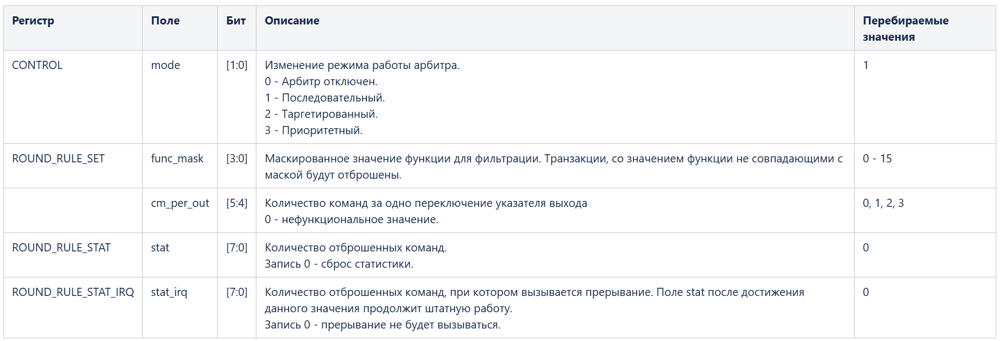
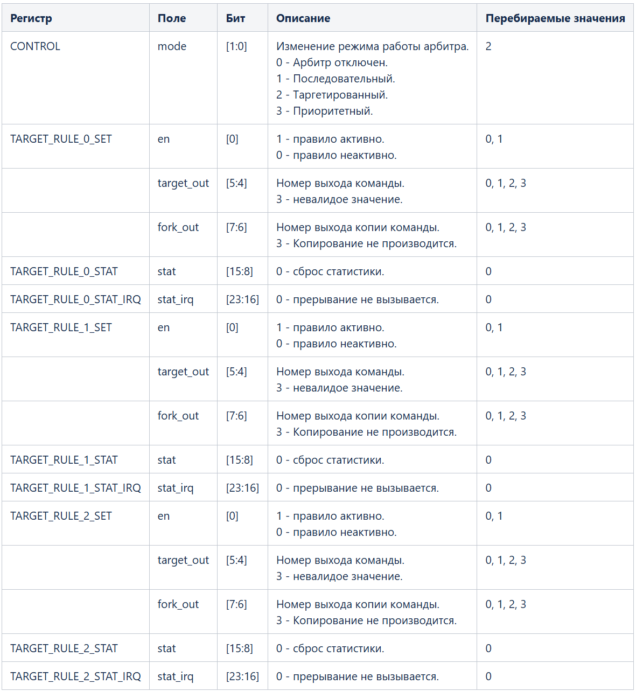
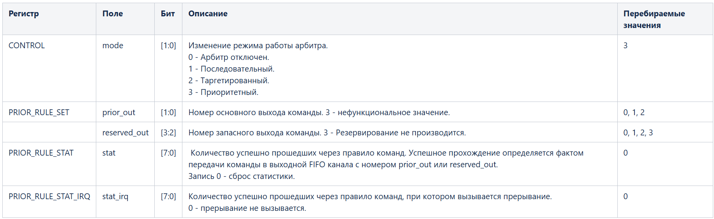
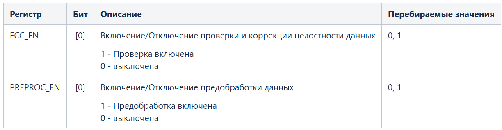
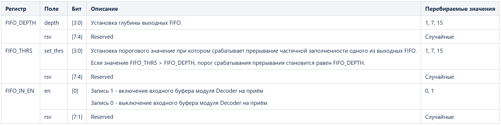

# Верификационный план

## 1. Список проверяемых характеристик 

| Feature | Name                         | Description                                   | Implementation                                                                                                                                 |
| ------- | ---------------------------- | --------------------------------------------- | ---------------------------------------------------------------------------------------------------------------------------------------------- |
| 1       | Корректность передачи данных | Сравнение входных и выходных данных           | Каждая собранная транзакция попадает в Scoreboard, где сравнивается значение полей Address и Data                                              |
| 2       | Выставление прерываний       | Функции, связанные с работой прерываний       |                                                                                                                                                |
| 2.1     | Assert                       | Проверка корректности выставления прерываний  | При получении ошибочных транзакций в Scoreboard взводится счётчик на 3 такта, после которых провод IRQ должен изменить значение на 1           |
| 2.2     | Deassert                     | Проверка корректности снятия прерываний       | При получении запросов на очистку прерываний в Scoreboard взводится счётчик на 3 такта, после которых провод IRQ должен изменить значение на 0 |
| 2.3     | Mask                         | Проверка корректности маскирования прерываний | Провод IRQ не должен принимать значение 1, если прерывание замаскировано                                                                       |
| 2.4     | ...                          | ...                                           | ...                                                                                                                                            |
|         |                              |                                               |                                                                                                                                                |

## 2. Тестовые сценарии

> [!NOTE] Информация для тестов
> 1. Период тактового сигнала во всех тестах равен 10 нс
> 2. Любой подаваемый сброс в тестах является валидным (минимум 2 такта)

| Название теста                                               | Описание                                                                                                                                                                                                                                                                                                                                                                                                                                                                                                                                                                                                                                                                                                                                                                                                                                                                                                                                                                                                                                                                                                                                                                                                                                                                                                                                                                                                                                                                                                                                                                                                                                                                                                                                                                                                                                                                                                                                                                                                                                                                                                                                                                                                                                                                                                                                                                                                                                                                                                                                                                                                                                                                                                                                                                                                                                                                                                                                                                                                                                                                                                                                                                                                                                                                                                                                                                                                                                                                                                                                                                                                                                                                                                                                                                                                                                                                                                                                                                                                                                                                                                                                                                                                                                                                                                                                                                                                                                                                                                                                                                                                                                                                                                                                                                                                                                                                                                                                                                                                                                                                                                                                                                                                                                                                                                                                                                                                                                                                                                                                                                                                                                                                                                                                                                                                                                                                                                                                                                                                                                                                                                                                                                                                                                                                                                                                                                                                                                                                                                                                                                                                                                                                                                                                                                                                                                                                                                                                                                                                                                                                                                                                                                                                                                                                                                                                                                                                                                                                                                                                                                                                                                                                                                                                                                                                                                                                                                                                                                                                                                                                                                                                                                                                                                                                                                                                                                                                                                                                                                                                                                                                                                                                                                      | Флаг запуска в run.sh    |
| ------------------------------------------------------------ | ------------------------------------------------------------------------------------------------------------------------------------------------------------------------------------------------------------------------------------------------------------------------------------------------------------------------------------------------------------------------------------------------------------------------------------------------------------------------------------------------------------------------------------------------------------------------------------------------------------------------------------------------------------------------------------------------------------------------------------------------------------------------------------------------------------------------------------------------------------------------------------------------------------------------------------------------------------------------------------------------------------------------------------------------------------------------------------------------------------------------------------------------------------------------------------------------------------------------------------------------------------------------------------------------------------------------------------------------------------------------------------------------------------------------------------------------------------------------------------------------------------------------------------------------------------------------------------------------------------------------------------------------------------------------------------------------------------------------------------------------------------------------------------------------------------------------------------------------------------------------------------------------------------------------------------------------------------------------------------------------------------------------------------------------------------------------------------------------------------------------------------------------------------------------------------------------------------------------------------------------------------------------------------------------------------------------------------------------------------------------------------------------------------------------------------------------------------------------------------------------------------------------------------------------------------------------------------------------------------------------------------------------------------------------------------------------------------------------------------------------------------------------------------------------------------------------------------------------------------------------------------------------------------------------------------------------------------------------------------------------------------------------------------------------------------------------------------------------------------------------------------------------------------------------------------------------------------------------------------------------------------------------------------------------------------------------------------------------------------------------------------------------------------------------------------------------------------------------------------------------------------------------------------------------------------------------------------------------------------------------------------------------------------------------------------------------------------------------------------------------------------------------------------------------------------------------------------------------------------------------------------------------------------------------------------------------------------------------------------------------------------------------------------------------------------------------------------------------------------------------------------------------------------------------------------------------------------------------------------------------------------------------------------------------------------------------------------------------------------------------------------------------------------------------------------------------------------------------------------------------------------------------------------------------------------------------------------------------------------------------------------------------------------------------------------------------------------------------------------------------------------------------------------------------------------------------------------------------------------------------------------------------------------------------------------------------------------------------------------------------------------------------------------------------------------------------------------------------------------------------------------------------------------------------------------------------------------------------------------------------------------------------------------------------------------------------------------------------------------------------------------------------------------------------------------------------------------------------------------------------------------------------------------------------------------------------------------------------------------------------------------------------------------------------------------------------------------------------------------------------------------------------------------------------------------------------------------------------------------------------------------------------------------------------------------------------------------------------------------------------------------------------------------------------------------------------------------------------------------------------------------------------------------------------------------------------------------------------------------------------------------------------------------------------------------------------------------------------------------------------------------------------------------------------------------------------------------------------------------------------------------------------------------------------------------------------------------------------------------------------------------------------------------------------------------------------------------------------------------------------------------------------------------------------------------------------------------------------------------------------------------------------------------------------------------------------------------------------------------------------------------------------------------------------------------------------------------------------------------------------------------------------------------------------------------------------------------------------------------------------------------------------------------------------------------------------------------------------------------------------------------------------------------------------------------------------------------------------------------------------------------------------------------------------------------------------------------------------------------------------------------------------------------------------------------------------------------------------------------------------------------------------------------------------------------------------------------------------------------------------------------------------------------------------------------------------------------------------------------------------------------------------------------------------------------------------------------------------------------------------------------------------------------------------------------------------------------------------------------------------------------------------------------------------------------------------------------------------------------------------------------------------------------------------------------------------------------------------------------------------------------------------------------------------------------------------------------------------------------------------------------------------------------------------------------------------------------- | ------------------------ |
| Проверка регистрового пространства                           | <ol><li>Подача сигнала тактирования</li><li>Подача сигнала сброса</li><li>Чтение всех регистров</li><li>Запись единиц во все биты всех регистров</li><li>Чтение всех регистров</li><li>Чтение по всем адресам за пределами адресного пространства</li><li>Запись нулей во все биты по всем адресам за пределами адресного пространства</li></ol>                                                                                                                                                                                                                                                                                                                                                                                                                                                                                                                                                                                                                                                                                                                                                                                                                                                                                                                                                                                                                                                                                                                                                                                                                                                                                                                                                                                                                                                                                                                                                                                                                                                                                                                                                                                                                                                                                                                                                                                                                                                                                                                                                                                                                                                                                                                                                                                                                                                                                                                                                                                                                                                                                                                                                                                                                                                                                                                                                                                                                                                                                                                                                                                                                                                                                                                                                                                                                                                                                                                                                                                                                                                                                                                                                                                                                                                                                                                                                                                                                                                                                                                                                                                                                                                                                                                                                                                                                                                                                                                                                                                                                                                                                                                                                                                                                                                                                                                                                                                                                                                                                                                                                                                                                                                                                                                                                                                                                                                                                                                                                                                                                                                                                                                                                                                                                                                                                                                                                                                                                                                                                                                                                                                                                                                                                                                                                                                                                                                                                                                                                                                                                                                                                                                                                                                                                                                                                                                                                                                                                                                                                                                                                                                                                                                                                                                                                                                                                                                                                                                                                                                                                                                                                                                                                                                                                                                                                                                                                                                                                                                                                                                                                                                                                                                                                                                                                              | `+REG_TEST`              |
| Сброс на лету                                                | <ol><li>Подача сигнала тактирования </li><li>Подача сигнала сброса </li><li>Циклическое повторение пунктов a‑d, пока не произойдёт 1000 сбросов <ol type="a"><li>(a) Если на предыдущей итерации цикла не осуществлялся сброс, происходит остановка приёма транзакций и очистка очередей fifo (запись `FIFO_IN_EN`=0, `FIFO_CLR`=1) </li><li>(b) Запуск двух параллельных процессов: <ol type="i"><li>(i) Регистры устройства конфигурируются случайными допустимыми значениями, затем на устройство по AXIS подаётся случайное (от 0 до 10000) число транзакций, по окончании которых происходит завершение <strong>пункта b</strong> и переход к <strong>пункту c</strong> </li><li>(ii) В случайный момент времени (до или после окончания процесса <strong>i</strong>) завершить <strong>пункт b</strong> и перейти к <strong>пункту c</strong> </li></ol></li><li>(c) Если процесс <strong>ii</strong> завершился раньше <strong>i</strong>, происходит подача сигнала сброса случайной длительности (от 2 до 10 периодов тактового сигнала), иначе — сигнал сброса не подаётся </li><li>(d) Чтение всех регистров </li></ol></li></ol>                                                                                                                                                                                                                                                                                                                                                                                                                                                                                                                                                                                                                                                                                                                                                                                                                                                                                                                                                                                                                                                                                                                                                                                                                                                                                                                                                                                                                                                                                                                                                                                                                                                                                                                                                                                                                                                                                                                                                                                                                                                                                                                                                                                                                                                                                                                                                                                                                                                                                                                                                                                                                                                                                                                                                                                                                                                                                                                                                                                                                                                                                                                                                                                                                                                                                                                                                                                                                                                                                                                                                                                                                                                                                                                                                                                                                                                                                                                                                                                                                                                                                                                                                                                                                                                                                                                                                                                                                                                                                                                                                                                                                                                                                                                                                                                                                                                                                                                                                                                                                                                                                                                                                                                                                                                                                                                                                                                                                                                                                                                                                                                                                                                                                                                                                                                                                                                                                                                                                                                                                                                                                                                                                                                                                                                                                                                                                                                                                                                                                                                                                                                                                                                                                                                                                                                                                                                                                                                                                                                                                                                                                                                                                                                                                                                                                                                                                                                                                                                                                                                                       | `+RESET_ON_THE_FLY_TEST` |
| Работа арбитра в последовательном режиме с опросом регистров | <ol><li>Подача сигнала тактирования</li><li>Подача сигнала сброса</li><li>Установка у выходных AXI-Stream интерфейсов сигнала tready в постоянно высокий (активный) уровень</li><li>Установка базовой конфигурации</li><li>Циклическое повторение <strong>пунктов 6-9</strong>, пока не будут перебраны все сочетания конфигураций из таблицы в <strong>пункте 7</strong></li><li>Запись:<ol><li>`FIFO_IN_EN` = 1'b0;</li><li>`FIFO_CLR` = 1'b1;</li></ol></li><li>Конфигурация блока. Значения берутся из таблицы снизу, подаются на шину последовательно в порядке, указанном в таблице ниже</li><li>Запись `FIFO_IN_EN` = 1'b1</li><li>Запускаются два параллельных процесса:<ol type="a"><li>(a) <em>Подается базовой последовательности входных инструкций</em>. Затем ожидается окончание цикла чтения регистров из процесса <strong>b</strong> и завершается <strong>пункт 9</strong> целиком (оба процесса)</li><li>(b) Чтение значений регистров, относящихся к тестируемому режиму арбитра, и регистра статуса прерываний (опрос происходит в бесконечном цикле):<ol type="i"><li>(i) `ROUND_RULE_SET`</li><li>(ii) `ROUND_RULE_STAT`</li><li>(iii) `ROUND_RULE_STAT_IRQ`</li><li>(iv) `INTR_STAT`</li></ol></li></ol></li></ol>                                                                                                                                                                                                                                                                                                                                                                                                                                                                                                                                                                                                                                                                                                                                                                                                                                                                                                                                                                                                                                                                                                                                                                                                                                                                                                                                                                                                                                                                                                                                                                                                                                                                                                                                                                                                                                                                                                                                                                                                                                                                                                                                                                                                                                                                                                                                                                                                                                                                                                                                                                                                                                                                                                                                                                                                                                                                                                                                                                                                                                                                                                                                                                                                                                                                                                                                                                                                                                                                                                                                                                                                                                                                                                                                                                                                                                                                                                                                                                                                                                                                                                                                                                                                                                                                                                                                                                                                                                                                                                                                                                                                                                                                                                                                                                                                                                                                                                                                                                                                                                                                                                                                                                                                                                                                                                                                                                                                                                                                                                                                                                                                                                                                                                                                                                                                                                                                                                                                                                                                                                                                                                                                                                                                                                                                                                                                                                                                                                                                                                                                                                                                                                                                                                                                                                                                                                                                                                                                                                                                                                                                                                                                                                                                                                                                                                                                                                                                                                      | `+ARBITER_ROUND_TEST`    |
| Работа арбитра в таргетированном режиме с опросом регистров  | <ol><li>Подача сигнала тактирования</li><li>Подача сигнала сброса</li><li>Установка базовой конфигурации</li><li>Установка у выходных AXI-Stream интерфейсов сигнала tready в постоянно высокий (активный) уровень</li><li>Конфигурация арбитра в таргетированный режим (`CONTROL` = 2'h2)</li><li>Циклическое повторение <strong>пунктов 7-10</strong>, пока не будут перебраны все сочетания конфигураций из таблицы (см. ниже)</li><li>Очистка FIFO через запись 1'b1 в регистр `FIFO_CLR`</li><li>Записываем комбинацию значений из таблицы (см. ниже) в соответствующие регистры `TARGET_RULE_0_*`, `TARGET_RULE_1_*`, `TARGET_RULE_2_*`</li><li>Установка `FIFO_IN_EN` в 1</li><li>Запускаются два параллельных процесса:<ol type="a"><li>(a) <em>Подается базовая последовательность входных инструкций</em>. Затем ожидается окончание цикла чтения регистров из процесса <strong>b</strong> и завершается <strong>пункт 10</strong> целиком (оба процесса)</li><li>(b) Чтение значений регистров, относящихся к тестируемому режиму арбитра, и регистра статуса прерываний (опрос происходит в бесконечном цикле):<ol type="i"><li>(i) `INTR_STAT`</li><li>(ii) `TARGET_RULE_0_STAT`</li><li>(iii) `TARGET_RULE_0_STAT_IRQ`</li><li>(iv) `TARGET_RULE_1_STAT`</li><li>(v) `TARGET_RULE_1_STAT_IRQ`</li><li>(vi) `TARGET_RULE_2_STAT`</li><li>(vii) `TARGET_RULE_2_STAT_IRQ`</li></ol></li></ol></li></ol>  _Важно:_ перебор значений _target_out_ и _fork_out_ для регистра TARGET_RULE_*_SET не выполняется, если поле _en_ этого регистра в конфигурации равно 0  _Важно:_ когда поле _target_out_ соответствующего регистра равно 3, проверяется лишь одна комбинация с _fork_out_  Таблица конфигураций                                                                                                                                                                                                                                                                                                                                                                                                                                                                                                                                                                                                                                                                                                                                                                                                                                                                                                                                                                                                                                                                                                                                                                                                                                                                                                                                                                                                                                                                                                                                                                                                                                                                                                                                                                                                                                                                                                                                                                                                                                                                                                                                                                                                                                                                                                                                                                                                                                                                                                                                                                                                                                                                                                                                                                                                                                                                                                                                                                                                                                                                                                                                                                                                                                                                                                                                                                                                                                                                                                                                                                                                                                                                                                                                                                                                                                                                                                                                                                                                                                                                                                                                                                                                                                                                                                                                                                                                                                                                                                                                                                                                                                                                                                                                                                                                                                                                                                                                                                                                                                                                                                                                                                                                                                                                                                                                                                                                                                                                                                                                                                                                                                                                                                                                                                                                                                                                                                                                                                                                                                                                                                                                                                                                                                                                                                                                                                                                                                                                                                                                                                                                                                                                                                                                                                                                                                                                                                                                    | `+ARBITER_TARGET_TEST`   |
| Работа арбитра в приоритетном режиме с опросом регистров     | <ol><li>Подача сигнала тактирования</li><li>Подача сигнала сброса</li><li>Конфигурация выходных AXI-Stream интерфейсов для переключения (изменения уровня сигнала) сигнала tready каждый такт</li><li>Установка базовой конфигурации</li><li>Циклическое повторение <strong>пунктов 6-9</strong>, пока не будут перебраны все сочетания конфигураций из таблицы в <strong>пункте 7</strong></li><li>Запись:<ol><li>`FIFO_IN_EN` = 1'b0;</li><li>`FIFO_CLR` = 1'b1;</li></ol></li><li>Конфигурация блока. Значения берутся из таблицы снизу, подаются на шину последовательно в порядке, указанном в таблице ниже</li><li>Установка `FIFO_IN_EN` = 1'b1;</li><li>Запускаются два параллельных процесса:<ol type="a"><li>(a) <em>Подается базовой последовательности входных инструкций</em>. Затем ожидается окончание цикла чтения регистров из процесса <strong>b</strong> и завершается <strong>пункт 9</strong> целиком (оба процесса)</li><li>(b) Чтение значений регистров, относящихся к тестируемому режиму арбитра, и регистра статуса прерываний (опрос происходит в бесконечном цикле)<ol type="i"><li>(i) `PRIOR_RULE_SET`</li><li>(ii) `PRIOR_RULE_STAT`</li><li>(iii) `PRIOR_RULE_STAT_IRQ`</li><li>(iv) `INTR_STAT`</li></ol></li></ol></li></ol>                                                                                                                                                                                                                                                                                                                                                                                                                                                                                                                                                                                                                                                                                                                                                                                                                                                                                                                                                                                                                                                                                                                                                                                                                                                                                                                                                                                                                                                                                                                                                                                                                                                                                                                                                                                                                                                                                                                                                                                                                                                                                                                                                                                                                                                                                                                                                                                                                                                                                                                                                                                                                                                                                                                                                                                                                                                                                                                                                                                                                                                                                                                                                                                                                                                                                                                                                                                                                                                                                                                                                                                                                                                                                                                                                                                                                                                                                                                                                                                                                                                                                                                                                                                                                                                                                                                                                                                                                                                                                                                                                                                                                                                                                                                                                                                                                                                                                                                                                                                                                                                                                                                                                                                                                                                                                                                                                                                                                                                                                                                                                                                                                                                                                                                                                                                                                                                                                                                                                                                                                                                                                                                                                                                                                                                                                                                                                                                                                                                                                                                                                                                                                                                                                                                                                                                                                                                                                                                                                                                                                                                                                                                                                                                                                                                                                                                                                                                                                 | `+ARBITER_PRIOR_TEST`    |
| Работа блока при разных конфигурациях регистров CORE         | <ol><li>Подача сигнала тактирования</li><li>Подача сигнала сброса</li><li>Установка базовой конфигурации</li><li>Циклическое повторение <strong>пунктов 5-6</strong>, пока не будут перебраны все сочетания конфигураций из таблицы в <strong>пункте 5</strong></li><li>Сконфигурировать CORE, записав в соответствующие регистры из таблицы ниже комбинацию значений</li><li><em>Подается базовая последовательность входных инструкций</em>.</li></ol>                                                                                                                                                                                                                                                                                                                                                                                                                                                                                                                                                                                                                                                                                                                                                                                                                                                                                                                                                                                                                                                                                                                                                                                                                                                                                                                                                                                                                                                                                                                                                                                                                                                                                                                                                                                                                                                                                                                                                                                                                                                                                                                                                                                                                                                                                                                                                                                                                                                                                                                                                                                                                                                                                                                                                                                                                                                                                                                                                                                                                                                                                                                                                                                                                                                                                                                                                                                                                                                                                                                                                                                                                                                                                                                                                                                                                                                                                                                                                                                                                                                                                                                                                                                                                                                                                                                                                                                                                                                                                                                                                                                                                                                                                                                                                                                                                                                                                                                                                                                                                                                                                                                                                                                                                                                                                                                                                                                                                                                                                                                                                                                                                                                                                                                                                                                                                                                                                                                                                                                                                                                                                                                                                                                                                                                                                                                                                                                                                                                                                                                                                                                                                                                                                                                                                                                                                                                                                                                                                                                                                                                                                                                                                                                                                                                                                                                                                                                                                                                                                                                                                                                                                                                                                                                                                                                                                                                                                                                                                                                                                                                                                                                                                                                                                     | `+CORE_TEST`             |
| Работа блока при различных значениях регистров DATA_REGS     | <ol><li>Подача сигнала тактирования.</li><li>Подача сигнала сброса.</li><li>Конфигурация выходных AXI-Stream интерфейсов для переключения (изменения уровня сигнала) сигнала tready каждый такт.</li><li>Установка базовой конфигурации.</li><li>Запись значения 8'h00 (8'b0000_0000) во все регистры `DATA_REGS`.</li><li>Запись `FIFO_IN_EN` = 1'b1.</li><li><em>Подача базовой последовательности входных инструкций</em>.</li><li>Ожидание 100 тактов после последней завершенной транзакции на выходных AXI-Stream интерфейсах.</li><li>Запись:<ol type="a"><li>(a) `FIFO_IN_EN` = 1'b0.</li><li>(b) `FIFO_CLR` = 1'b1;</li></ol></li><li>Считывание данных из всех регистров `DATA_REGS`.</li><li>Запись значения 8'hFF (8'b1111_1111) во все регистры `DATA_REGS`.</li><li>Запись `FIFO_IN_EN` = 1'b1.</li><li><em>Подача базовой последовательности входных инструкций</em>.</li><li>Ожидание 100 тактов после последней завершенной транзакции на выходных AXI-Stream интерфейсах.</li><li>Запись:<ol type="a"><li>(a) `FIFO_IN_EN` = 1'b0;</li><li>(b) `FIFO_CLR` = 1'b1.</li></ol></li><li>Считывание данных из всех регистров `DATA_REGS`.</li><li>Циклическое повторение <strong>пунктов a-f</strong> 5 раз:<ol type="a"><li>(a) Запись:<ol type="i"><li>(i) `FIFO_IN_EN` = 1'b0;</li><li>(ii) `FIFO_CLR` = 1'b1.</li></ol></li><li>(b) Считывание данных из всех регистров `DATA_REGS`.</li><li>(c) Запись случайных значений во все регистры `DATA_REGS`.</li><li>(d) Запись `FIFO_IN_EN` = 1'b1.</li><li>(e) <em>Подача базовой последовательности входных инструкций</em>.</li><li>(f) Ожидание 100 тактов после последней завершенной транзакции на выходных AXI-Stream интерфейсах.</li></ol></li></ol>                                                                                                                                                                                                                                                                                                                                                                                                                                                                                                                                                                                                                                                                                                                                                                                                                                                                                                                                                                                                                                                                                                                                                                                                                                                                                                                                                                                                                                                                                                                                                                                                                                                                                                                                                                                                                                                                                                                                                                                                                                                                                                                                                                                                                                                                                                                                                                                                                                                                                                                                                                                                                                                                                                                                                                                                                                                                                                                                                                                                                                                                                                                                                                                                                                                                                                                                                                                                                                                                                                                                                                                                                                                                                                                                                                                                                                                                                                                                                                                                                                                                                                                                                                                                                                                                                                                                                                                                                                                                                                                                                                                                                                                                                                                                                                                                                                                                                                                                                                                                                                                                                                                                                                                                                                                                                                                                                                                                                                                                                                                                                                                                                                                                                                                                                                                                                                                                                                                                                                                                                                                                                                                                                                                                                                                                                                                                                                                                                                                                                                                                                                                                                                                                                                                                                                                                                                                                                                                                                                                    | `+DATA_REG_TEST`         |
| Работа выходных FIFO при различных конфигурациях             | <ol><li>Подача сигнала тактирования</li><li>Подача сигнала сброса</li><li>Установка базовой конфигурации</li><li>Конфигурация сигнaла tready у выходных AXI-Stream интерфейсов:<ol type="a"><li>(a) активный (высокий, 1'b1) уровень со случайной длительностью от 1 до 3 тактов</li><li>(b) неактивный (низкий, 1'b0) уровень со случайной длительностью от 1 до 10 тактов</li></ol></li><li>Циклическое повторение <strong>пунктов 6-8</strong>, пока не будут перебраны все сочетания конфигураций из таблицы (см. ниже)</li><li>Запись `FIFO_CLR` = 1'b1</li><li>Записываем комбинацию значений из таблицы (см. ниже) в соответствующие регистры</li><li>Запускаются два параллельных процесса:<ol type="a"><li>(a) Если `FIFO_IN_EN` == 1:<ol type="i"><li>(i) Подача базовой последовательности входных инструкций.</li><li>(ii) Ожидание 5 тактов для подтверждения выхода задержавшихся выходных данных</li><li>(iii) Завершение <strong>пункта 8</strong> целиком (оба процесса)</li></ol></li><li>(b) Чтение значений регистров таргетированного режима арбитра и регистра статуса прерываний (опрос происходит в бесконечном цикле)<ol type="i"><li>(i) `INTR_STAT`</li><li>(ii) `TARGET_RULE_0_STAT`</li><li>(iii) `TARGET_RULE_0_STAT_IRQ`</li><li>(iv) `TARGET_RULE_1_STAT`</li><li>(v) `TARGET_RULE_1_STAT_IRQ`</li><li>(vi) `TARGET_RULE_2_STAT`</li><li>(vii) `TARGET_RULE_2_STAT_IRQ`</li></ol></li></ol></li></ol> Перебираемые значения регистров:                                                                                                                                                                                                                                                                                                                                                                                                                                                                                                                                                                                                                                                                                                                                                                                                                                                                                                                                                                                                                                                                                                                                                                                                                                                                                                                                                                                                                                                                                                                                                                                                                                                                                                                                                                                                                                                                                                                                                                                                                                                                                                                                                                                                                                                                                                                                                                                                                                                                                                                                                                                                                                                                                                                                                                                                                                                                                                                                                                                                                                                                                                                                                                                                                                                                                                                                                                                                                                                                                                                                                                                                                                                                                                                                                                                                                                                                                                                                                                                                                                                                                                                                                                                                                                                                                                                                                                                                                                                                                                                                                                                                                                                                                                                                                                                                                                                                                                                                                                                                                                                                                                                                                                                                                                                                                                                                                                                                                                                                                                                                                                                                                                                                                                                                                                                                                                                                                                                                                                                                                                                                                                                                                                                                                                                                                                                                                                                                                                                                                                                                                                                                                                                                                                                                                                                                                                                                                                                                                                                                                                                                                                                                                                                                    | `+FIFO_TEST`             |
| Прерывания в CORE                                            | <ol><li>Подача сигнала тактирования</li><li>Подача сигнала сброса</li><li>Установка базовой конфигурации</li><li>Циклическое повторение <strong>пунктов 5-14</strong>, пока не будут перебраны все прерывания, генерируемые из CORE</li><li>Запись:<ol type="a"><li>(a) `FIFO_IN_EN` = 1'b0</li><li>(b) `FIFO_CLR` = 1'b1</li></ol></li><li>Сконфигурировать блок:<ol type="a"><li>(a) Записать значения в регистры `ECC_EN` (если проверяется `CORE_INTR_ECC_2` - 1, иначе - 0) и `PREPROC_EN` (случайное: 0 или 1)</li><li>(b) Записать значение в регистр `INTR_EN` (в биты прерываний НЕ из CORE - 0, в биты прерываний из CORE - комбинация, перебираемая в рамках итерации цикла <strong>пунктов 5-8</strong>)</li></ol></li><li>Запись `FIFO_IN_EN` = 1'b1</li><li>Подать на вход данные, провоцирующие прерывания</li><li>Чтение значения регистра `INTR_STAT`</li><li>Запись:<ol type="a"><li>(a) `FIFO_IN_EN` = 1'b0</li><li>(b) `FIFO_CLR` = 1'b1</li></ol></li><li>Запись `INTR_CLR` = 8'hFF</li><li>Запись `INTR_EN` = 8'h0</li><li>Запись `FIFO_IN_EN` = 1'b1</li><li>Подать на вход данные, провоцирующие прерывания</li></ol>                                                                                                                                                                                                                                                                                                                                                                                                                                                                                                                                                                                                                                                                                                                                                                                                                                                                                                                                                                                                                                                                                                                                                                                                                                                                                                                                                                                                                                                                                                                                                                                                                                                                                                                                                                                                                                                                                                                                                                                                                                                                                                                                                                                                                                                                                                                                                                                                                                                                                                                                                                                                                                                                                                                                                                                                                                                                                                                                                                                                                                                                                                                                                                                                                                                                                                                                                                                                                                                                                                                                                                                                                                                                                                                                                                                                                                                                                                                                                                                                                                                                                                                                                                                                                                                                                                                                                                                                                                                                                                                                                                                                                                                                                                                                                                                                                                                                                                                                                                                                                                                                                                                                                                                                                                                                                                                                                                                                                                                                                                                                                                                                                                                                                                                                                                                                                                                                                                                                                                                                                                                                                                                                                                                                                                                                                                                                                                                                                                                                                                                                                                                                                                                                                                                                                                                                                                                                                                                                                                                                                                                                                                                                                                                                                                                                                                                                                                                                                                                                                                                                                                 | `+CORE_INTERRUPT_TEST`   |
| Прерывания в арбитре                                         | <ol><li>Подача сигнала тактирования</li><li>Подача сигнала сброса</li><li>Установка у выходных AXI-Stream интерфейсов сигнала tready в постоянно высокий (активный) уровень</li><li>Установка базовой конфигурации</li><li>Проверка прерывания <strong>ARB_INTR_NO_OUT</strong>:<ol type="a"><li>(a) Конфигурация сигнaла tready у выходных AXI-Stream интерфейсов:<ol type="i"><li>(i) активный (высокий, 1'b1) уровень длительностью 1 такт</li><li>(ii) неактивный (низкий, 1'b0) уровень длительностью 9 тактов</li></ol></li><li>(b) Настройка арбитра <strong>в последовательный режим</strong>:<ol type="i"><li>(i) Запись:<ol><li>CONTROL = 1</li><li>ROUND_RULE_STAT = 0</li><li>ROUND_RULE_STAT_IRQ = 0</li></ol></li><li>(ii) Установка одного из функциональных значений поля cm_per_out регистра ROUND_RULE_SET</li><li>(iii) Установка одного из функциональных значений поля func_mask регистра ROUND_RULE_SET</li><li>(iv) Включение прерывания ARB_INTR_NO_OUT записью в регистр INTR_EN</li><li>(v) Запись FIFO_IN_EN = 1'b1</li><li>(vi) <em>Подача укороченной базовой последовательности входных инструкций</em></li><li>(vii) Запись:<ol><li>FIFO_IN_EN = 1'b0</li><li>FIFO_CLR = 1'b1</li></ol></li><li>(viii) Очистка прерывания записью в INTR_CLR</li><li>(ix) Повторение v - viii, но с выключенным прерыванием ARB_INTR_NO_OUT</li><li>(x) Повторение ii - ix пока не будут перебраны все функциональные сочетания cm_per_out и func_mask</li></ol></li><li>(c) Настройка арбитра <strong>в таргетированный режим</strong>:<ol type="i"><li>(i) Запись:<ol><li>CONTROL = 2</li><li>TARGET_RULE_0_STAT_IRQ = 0</li><li>TARGET_RULE_1_STAT_IRQ = 0</li><li>TARGET_RULE_2_STAT_IRQ = 0</li></ol></li><li>(ii) Запись:<ol><li>TARGET_RULE_0_SET:<ol><li>fork_out = 3</li><li>target_out = 0</li><li>rsv = 0</li><li>en = 1</li></ol></li><li>TARGET_RULE_1_SET:<ol><li>fork_out = 3</li><li>target_out = 1</li><li>rsv = 0</li><li>en = 1</li></ol></li><li>TARGET_RULE_2_SET:<ol><li>fork_out = 3</li><li>target_out = 2</li><li>rsv = 0</li><li>en = 1</li></ol></li></ol></li><li>(iii) Включение прерывания ARB_INTR_NO_OUT записью в регистр INTR_EN</li><li>(iv) Запись FIFO_IN_EN = 1'b1</li><li>(v) <em>Подача укороченной базовой последовательности входных инструкций</em></li><li>(vi) Запись:<ol><li>FIFO_IN_EN = 1'b0</li><li>FIFO_CLR = 1'b1</li></ol></li><li>(vii) Очистка прерывания записью в INTR_CLR</li><li>(viii) Повторение iv - vii, но с выключенным прерыванием ARB_INTR_NO_OUT</li></ol></li><li>(d) Продолжение проверки арбитра <strong>в таргетированном режиме</strong>:<ol type="i"><li>(i) Перебор всех правил (включено только одно, остальные выключены)</li><li>(ii) Поля fork_out и target_out выбираются случайно, но так, чтобы fork_out != target_out</li><li>(iii) Выходной AXI-Stream интерфейс для fork_out реконфигурируется (tready держится в 1'b1 один такт, а в 1'b0 - четыре такта)</li><li>(iv) Выходной AXI-Stream интерфейс для target_out реконфигурируется (tready держится в 1'b0 один такт, а в 1'b1 - четыре такта)</li><li>(v) Включение прерывания ARB_INTR_NO_OUT</li><li>(vi) Запись FIFO_IN_EN = 1'b1</li><li>(vii) <em>Подача укороченной базовой последовательности входных инструкций</em></li><li>(viii) Запись:<ol><li>FIFO_IN_EN = 1'b0</li><li>FIFO_CLR = 1'b1</li></ol></li><li>(ix) Очистка прерывания записью в INTR_CLR</li><li>(x) Повторение vi - ix, но с выключенным прерыванием</li><li>(xi) Повторение i - x пока не переберутся все режимы (3 раза )</li></ol></li><li>(e) Настройка арбитра <strong>в приоритетный режим</strong>:<ol type="i"><li>(i) Конфигурация сигнaла tready у выходных AXI-Stream интерфейсов:<ol><li>активный (высокий, 1'b1) уровень длительностью 1 такт</li><li>неактивный (низкий, 1'b0) уровень длительностью 9 тактов</li></ol></li><li>(ii) Запись:<ol><li>CONTROL = 3</li><li>PRIOR_RULE_STAT = 0</li><li>PRIOR_RULE_STAT_IRQ = 0</li></ol></li><li>(iii) Установка одного из функциональных значений поля cm_per_out регистра ROUND_RULE_SET</li><li>(iv) Установка одного из функциональных значений поля func_mask регистра ROUND_RULE_SET</li><li>(v) Включение прерывания ARB_INTR_NO_OUT записью в регистр INTR_EN</li><li>(vi) Запись FIFO_IN_EN = 1'b1</li><li>(vii) <em>Подача укороченной базовой последовательности входных инструкций.</em></li><li>(viii) Запись:<ol><li>FIFO_IN_EN = 1'b0</li><li>FIFO_CLR = 1'b1</li></ol></li><li>(ix) Очистка прерывания записью в INTR_CLR</li><li>(x) Повторение vi - ix, но с выключенным прерыванием</li><li>(xi) Повторение iii и x пока не будут перебраны все функциональные сочетания reserved_out и reserved_out</li></ol></li></ol></li><li>Проверка прерывания <strong>ARB_INTR_CM_THRS</strong>:<ol type="a"><li>(a) Установка у выходных AXI-Stream интерфейсов сигнала tready в постоянно высокий (активный) уровень</li><li>(b) Включение арбитра в <strong>последовательный режим</strong>:<ol type="i"><li>(i) Запись:<ol><li>CONTROL_MODE = 1</li><li>ROUND_RULE_STAT = 0</li><li>ROUND_RULE_STAT_IRQ = 0</li></ol></li><li>(ii) Установка одного из функциональных значений поля cm_per_out регистра ROUND_RULE_SET</li><li>(iii) Установка одного из функциональных значений поля func_mask регистра ROUND_RULE_SET</li><li>(iv) Включение прерывания ARB_INTR_CM_THRS записью в регистр INTR_EN</li><li>(v) Запись FIFO_IN_EN = 1'b1</li><li>(vi) <em>Подача укороченной базовой последовательности входных инструкций</em></li><li>(vii) Запись ROUND_RULE_STAT = 0</li><li>(viii) Запись:<ol><li>FIFO_IN_EN = 1'b0</li><li>FIFO_CLR = 1'b1</li></ol></li><li>(ix) Очистка прерывания записью в INTR_CLR</li><li>(x) Повторение v - ix, но с выключенным прерыванием</li><li>(xi) Повторение ii - x пока не будут перебраны все функциональные сочетания cm_per_out и func_mask</li></ol></li><li>(c) Включение арбитра в <strong>таргетированный режим:</strong><ol type="i"><li>(i) Запись:<ol><li>CONTROL_MODE = 2</li><li>TARGET_RULE_0_STAT_IRQ = 0</li><li>TARGET_RULE_1_STAT_IRQ = 0</li><li>TARGET_RULE_2_STAT_IRQ = 0.</li></ol></li><li>(ii)  Запись:<ol><li>TARGET_RULE_0_STAT = 0</li><li>TARGET_RULE_1_STAT = 0</li><li>TARGET_RULE_2_STAT  = 0</li><li>TARGET_RULE_0_STAT_IRQ  = 2</li><li>TARGET_RULE_1_STAT_IRQ  = 0</li><li>TARGET_RULE_2_STAT_IRQ  = 0</li></ol></li><li>(iii) Запись:<ol><li>TARGET_RULE_0_SET:<ol><li>fork_out = 3</li><li>target_out = 0</li><li>rsv = 0</li><li>en = 1</li></ol></li><li>TARGET_RULE_1_SET:<ol><li>fork_out = 3</li><li>target_out = 1</li><li>rsv = 0</li><li>en = 1</li></ol></li><li>TARGET_RULE_2_SET:<ol><li>fork_out = 3</li><li>target_out = 2</li><li>rsv = 0</li><li>en = 1</li></ol></li></ol></li><li>(iv) Выключение прерывания записью в INTR_EN</li><li>(v) Установка FIFO_IN_EN = 1'b1</li><li>(vi) <em>Подача укороченной базовой последовательности входных инструкций</em></li><li>(vii) Запись:<ol><li>TARGET_RULE_0_STAT = 0</li><li>TARGET_RULE_1_STAT = 0</li><li>TARGET_RULE_2_STAT = 0</li></ol></li><li>(viii) Запись:<ol><li>FIFO_IN_EN = 1'b0</li><li>FIFO_CLR = 1'b1</li></ol></li><li>(ix) Очистка прерывания записью в INTR_CLR</li><li>(x) Повторение v - ix, но с выключенным прерыванием</li><li>(xi) Повторение ii - x, но в пункте i сдвинуть 2 на следующий TARGET_RULE, повторять пока 2 не побывает в каждом TARGET_RULE</li></ol></li><li>(d) Включение арбитра в <strong>приоритетный режим:</strong><ol type="i"><li>(i) Запись:<ol><li>CONTROL = 3</li><li>PRIOR_RULE_STAT = 0</li><li>PRIOR_RULE_STAT_IRQ = 0</li></ol></li><li>(ii) Установка одного из функциональных значений поля reserved_out регистра PRIOR_RULE_SET</li><li>(iii) Установка одного из функциональных значений поля prior_out регистра PRIOR_RULE_SET</li><li>(iv) Выключение прерывания записью в INTR_EN</li><li>(v) Установка FIFO_IN_EN = 1'b1</li><li>(vi) <em>Подача укороченной базовой последовательности входных инструкций</em></li><li>(vii) Установка PRIOR_RULE_STAT = 0</li><li>(viii) Запись:<ol><li>FIFO_IN_EN = 1'b0</li><li>FIFO_CLR = 1'b1</li></ol></li><li>(ix) Очистка прерывания записью в INTR_CLR</li><li>(x) Повторение v - ix но с выключенным прерыванием</li><li>(xi) Повторение ii - x пока не будут перебраны все функциональные сочетания reserved_out и reserved_out</li></ol></li></ol></li><li>Подача последней посылки:<ol type="a"><li>(a) У регистра PRIOR_RULE_SET поле reserved_out выставляется в 3, а prior_out в 1</li><li>(b) Выключаются прерывания</li><li>(c) Запись FIFO_IN_EN = 1'b1</li><li>(d) Подается укороченная базовая последовательность</li></ol></li></ol> | `+ARBITER_INTR_TEST`     |
| Прерывания в FIFO                                            | <ol><li>Подача сигнала тактирования</li><li>Подача сигнала сброса</li><li>Установка базовой конфигурации</li><li>Запись:<ol type="a"><li>(a) `FIFO_THRS` = 3</li><li>(b) `FIFO_DEPTH` = 6</li></ol></li><li>Конфигурация сигнaла tready у выходных AXI-Stream интерфейсов:<ol type="a"><li>(a) активный (высокий, 1'b1) уровень со случайной длительностью от 1 до 3 тактов</li><li>(b) неактивный (низкий, 1'b0) уровень со случайной длительностью от 1 до 10 тактов</li></ol></li><li>Запись `FIFO_CLR` = 1'b1</li><li>Запись `INTR_CLR` = 1'b1</li><li>Запись `INTR_EN` = 8'b0000_0001</li><li>Запись `FIFO_IN_EN` = 1'b1</li><li>Запускаются два параллельных процесса:<ol type="a"><li>(a) Подача базовой последовательности входных инструкций, по окончании которой завершение <strong>пункта 10</strong> целиком (оба процесса)</li><li>(b) Чтение значений регистров таргетированного режима арбитра и регистра статуса прерываний (опрос происходит в бесконечном цикле)<ol><li>`INTR_STAT_ADDR`</li><li>`TARGET_RULE_0_STAT`</li><li>`TARGET_RULE_0_STAT_IRQ`</li><li>`TARGET_RULE_1_STAT`</li><li>`TARGET_RULE_1_STAT_IRQ`</li><li>`TARGET_RULE_2_STAT`</li><li>`TARGET_RULE_2_STAT_IRQ`</li></ol></li></ol></li><li>Повторение <strong>пунктов 6-10</strong> с одним исключением: в <strong>8 пункте</strong> `INTR_EN` = 8'b0000_0000</li></ol>                                                                                                                                                                                                                                                                                                                                                                                                                                                                                                                                                                                                                                                                                                                                                                                                                                                                                                                                                                                                                                                                                                                                                                                                                                                                                                                                                                                                                                                                                                                                                                                                                                                                                                                                                                                                                                                                                                                                                                                                                                                                                                                                                                                                                                                                                                                                                                                                                                                                                                                                                                                                                                                                                                                                                                                                                                                                                                                                                                                                                                                                                                                                                                                                                                                                                                                                                                                                                                                                                                                                                                                                                                                                                                                                                                                                                                                                                                                                                                                                                                                                                                                                                                                                                                                                                                                                                                                                                                                                                                                                                                                                                                                                                                                                                                                                                                                                                                                                                                                                                                                                                                                                                                                                                                                                                                                                                                                                                                                                                                                                                                                                                                                                                                                                                                                                                                                                                                                                                                                                                                                                                                                                                                                                                                                                                                                                                                                                                                                                                                                                                                                                                                                                                                                                                                                                                                                                                                                                                                                                                                                                                                                                                                                                                                                                                                                                                | `+FIFO_INTERRUPT_TEST`   |

### Входные воздействия

В данном разделе описаны воздействия, которые будут подаваться на блок.

#### Базовая последовательность входных инструкций

Базовая последовательность входных инструкций - это перебор всех сочетаний типов инструкций (**opcode**) со всеми возможными значениями функций (**func**) и подача инструкций с этими сочетаниями на вход блока с "дрожащим" (мигающим) сигналом валидности.

Для инструкций A-type количество доступных, валидных для транзакции состояний (без учета содержания данных в регистрах reg0 и reg1): 2^(4+4+4) =  2^12

Для инструкций B-type количество доступных, валидных для транзакции состояний (без учета содержания данных в регистрах reg0): 2^(4+4+8) =  2^16

Для инструкций C-type количество доступных, валидных для транзакции состояний: 2^(4+8+8) =  2^20

Такое количество транзакций может оказаться слишком большим, поэтому имеет смысл оставить перебор только всех функций (**func**) и адресов регистров (**reg0**, **reg1**), значения констант выставлять **случайно**.  
Таким образом количество транзакций станет 2^(4+4+4) + 2^(4+4)+ 2^4 = 4 368.

#### Укороченная последовательность входных инструкций

Укороченная последовательность входных инструкций - это перебор всех типов инструкций (**opcode**) со всеми возможными значениями функций (**func**)

1. Выбирается один из типов инструкций (A-type, B-type, C-type)
2. Выбирается одно значений для **func** из диапазона от 0 до 15
3. Подается 20 случайных транзакций
4. Пункты 1 - 3 повторяются пока не переберутся все сочетания **opcode** и **func**

### Базовая конфигурация

| Регистр                             | Поле       | Значение                                                                                                         |
| ----------------------------------- | ---------- | ---------------------------------------------------------------------------------------------------------------- |
| **CORE** – **CORE_BA** = **0xC0**   |            |                                                                                                                  |
| ECC_EN                              |            | 0 - Отключение проверки и коррекции целостности данных                                                           |
| PREPROC_EN                          |            | 0 - Отключение предобработки данных                                                                              |
| **DATA_BA** = **0xD0**              |            |                                                                                                                  |
| DATA_REGS [16]                      |            | Каждый DATA регистр имеет значение 0                                                                             |
| **Arbiter** – **ARB_BA** = **0xA0** |            |                                                                                                                  |
| CONTROL                             |            | 2 - Таргетированный режим                                                                                        |
| TARGET_RULE_0_SET                   | en         | 1 - Правило активно                                                                                              |
|                                     | target_out | 0                                                                                                                |
|                                     | fork_out   | 3                                                                                                                |
| TARGET_RULE_0_STAT                  | stat       | 0                                                                                                                |
| TARGET_RULE_0_STAT_IRQ              | stat_irq   | 0                                                                                                                |
| TARGET_RULE_1_SET                   | en         | 1 - Правило активно                                                                                              |
|                                     | target_out | 1                                                                                                                |
|                                     | fork_out   | 3                                                                                                                |
| TARGET_RULE_1_STAT                  | stat       | 0                                                                                                                |
| TARGET_RULE_1_STAT_IRQ              | stat_irq   | 0                                                                                                                |
| TARGET_RULE_2_SET                   | en         | 1 - Правило активно                                                                                              |
|                                     | target_out | 2                                                                                                                |
|                                     | fork_out   | 3                                                                                                                |
| TARGET_RULE_2_STAT                  | stat       | 0                                                                                                                |
| TARGET_RULE_2_STAT_IRQ              | stat_irq   | 0                                                                                                                |
| **FIFO** – **FIFO_BA** = **0xF0**   |            |                                                                                                                  |
| FIFO_DEPTH                          |            | Установка глубины выходных FIFO  2                                                                         |
| FIFO_THRS                           |            | Установка порогового значения, при котором срабатывает прерывание частичной заполненности выходных FIFO  2 |
| **INTR_BA** = **0x10**              |            |                                                                                                                  |
| INTR_EN                             |            | 0 (отключение всех прерываний)                                                                                   |
